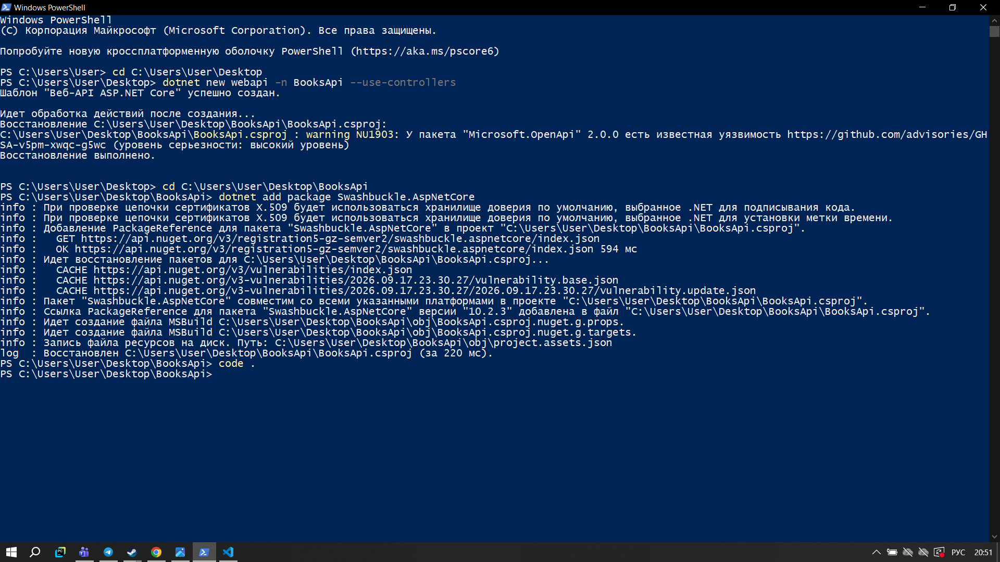
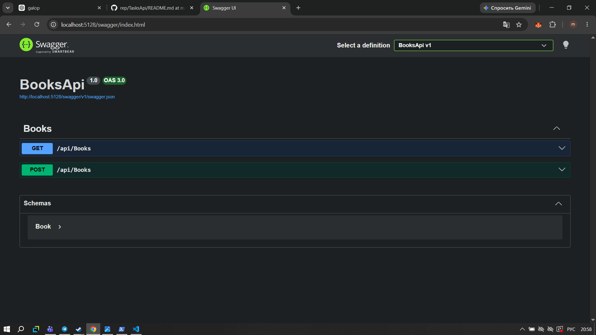
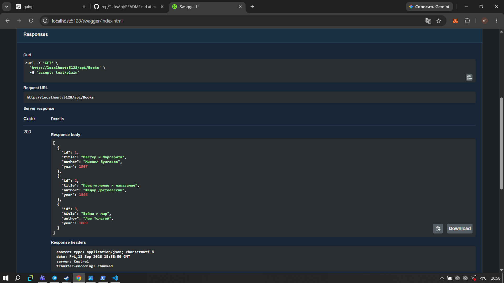
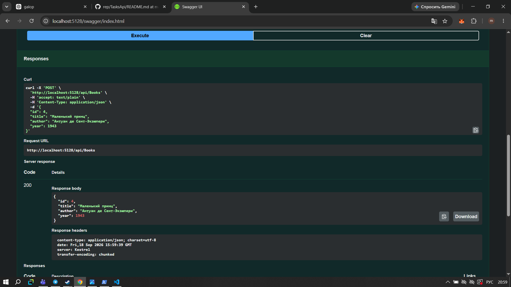
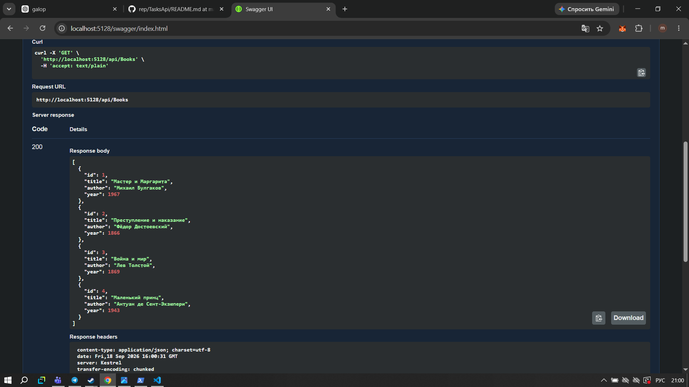

# Самостоятельная работа - Модуль 02

## Тема

Реализация веб-сервиса с применением ASP.NET Core.

## Цель работы

В этой работе я создала простой Web API на ASP.NET Core для управления списком книг. Я реализовала GET и POST запросы и проверила их работу с помощью Swagger UI.

## 1. Создание и запуск проекта

Сначала я создала проект ASP.NET Core Web API с использованием контроллеров. После запуска проекта проверила, что приложение работает локально.

Проект запустился на адресе:

`http://localhost:5128`



## 2. Swagger UI

Для тестирования API я использовала Swagger UI.

В Swagger отображаются два реализованных метода:

* GET `/api/Books`
* POST `/api/Books`



## 3. Получение списка книг

Сначала я выполнила GET-запрос:

`GET /api/Books`

Сервер успешно вернул список книг со статусом `200 OK`.



В списке находились три книги:

* «Мастер и Маргарита» — Михаил Булгаков;
* «Преступление и наказание» — Фёдор Достоевский;
* «Война и мир» — Лев Толстой.

## 4. Добавление новой книги

Затем я выполнила POST-запрос:

`POST /api/Books`

Для добавления я передала данные новой книги:

```json
{
  "id": 4,
  "title": "Маленький принц",
  "author": "Антуан де Сент-Экзюпери",
  "year": 1943
}
```

Сервер успешно добавил книгу и вернул статус `200 OK`.



## 5. Проверка добавления книги

После POST-запроса я повторно выполнила:

`GET /api/Books`

В результате список увеличился до четырёх книг. Новая книга «Маленький принц» появилась в списке.



## Результат работы

В ходе самостоятельной работы я создала Web API на ASP.NET Core для управления списком книг.

Я реализовала:

* модель `Book`;
* контроллер `BooksController`;
* GET-запрос для получения списка книг;
* POST-запрос для добавления новой книги;
* тестирование API через Swagger UI.

Данные хранятся в обычном списке `List<Book>`, поэтому база данных для этой работы не использовалась.

В результате я проверила получение списка книг, добавление новой книги и повторное получение списка после изменения данных.
