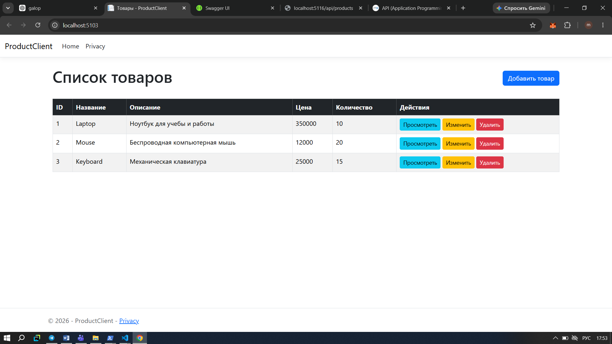
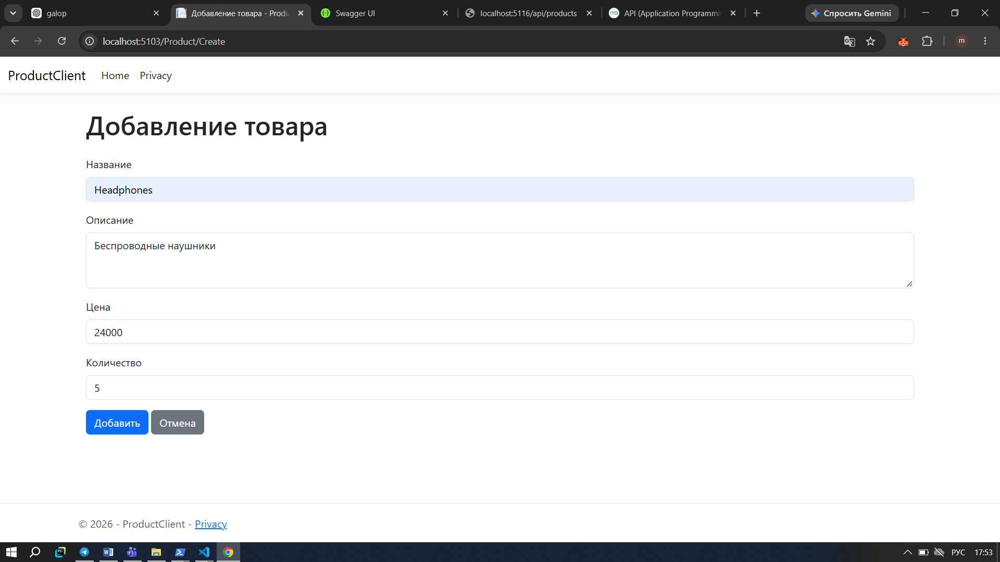
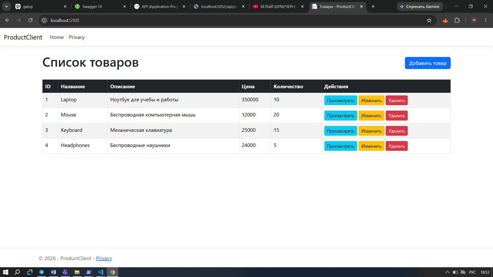
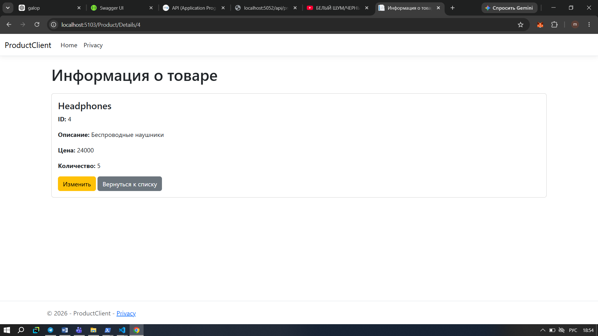
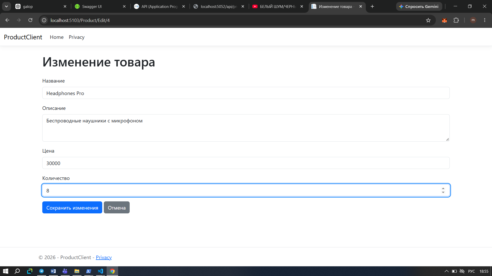
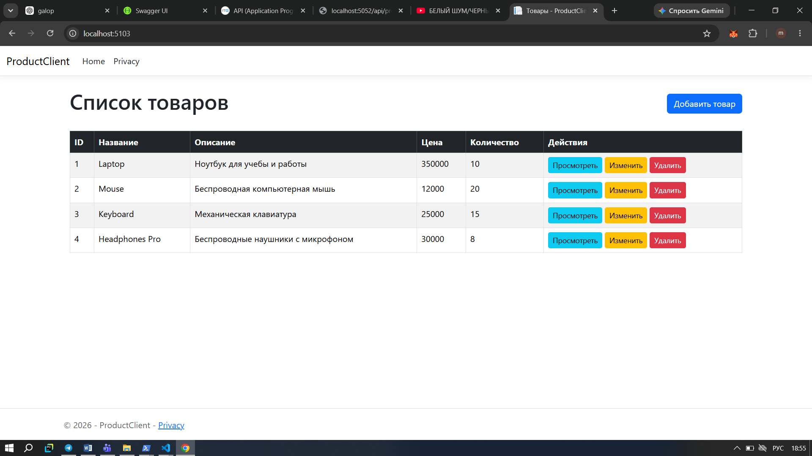
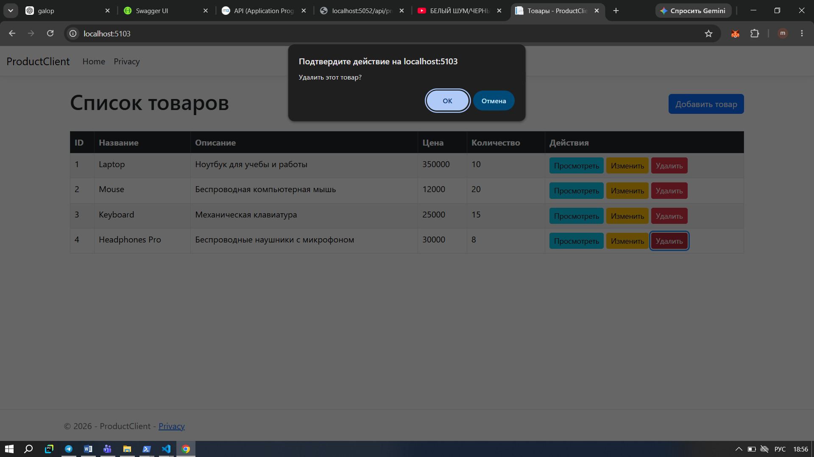
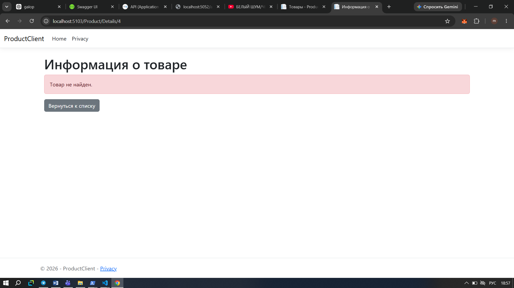
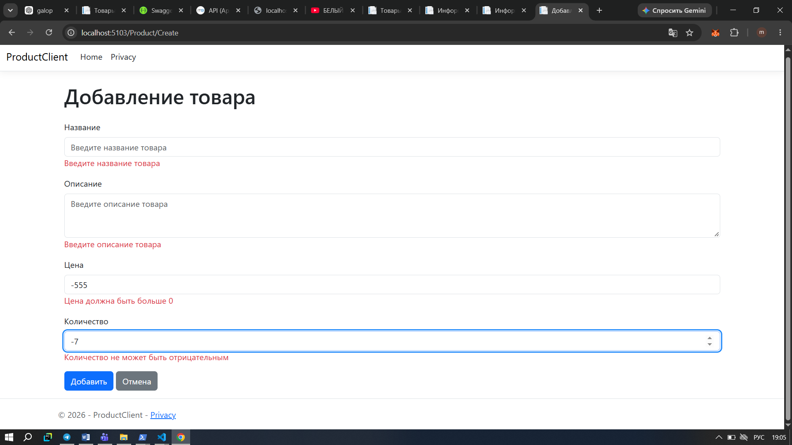

# Module 05 - Product API и Product Client

## Тема

Настройка использования Web API с помощью приложения ASP.NET Core.

## Цель работы

Целью работы было создать Web API для работы с товарами и отдельное ASP.NET Core приложение, которое обращается к этому API с помощью HTTP-запросов.

В работе я реализовала основные операции с товарами: получение списка, просмотр одного товара, добавление, изменение и удаление.

## Использованные технологии

* C#
* ASP.NET Core
* .NET 10
* REST API
* HTTP
* HttpClient
* IHttpClientFactory
* MVC
* JSON

## Структура работы

В работе используются два отдельных проекта:

```text
Module05-Products
├── ProductApi
│   ├── Controllers
│   ├── Models
│   ├── Services
│   ├── Screenshots
│   ├── .gitignore
│   ├── README.md
│   └── Program.cs
│
└── ProductClient
    ├── Controllers
    ├── Models
    ├── Services
    ├── Views
    ├── .gitignore
    └── Program.cs
```

`ProductApi` отвечает за серверную часть и обработку HTTP-запросов.

`ProductClient` является клиентским приложением. Через него пользователь может работать с товарами, а запросы отправляются в `ProductApi`.

## ProductApi

В API была создана модель `Product`.

Она содержит следующие поля:

* `Id` - идентификатор товара;
* `Name` - название товара;
* `Description` - описание товара;
* `Price` - цена;
* `Quantity` - количество.

Для хранения данных я использовала список `List<Product>`. Поэтому данные сохраняются во время работы приложения, но после перезапуска API список возвращается к исходным значениям.

### Реализованные методы API

| Метод  | Адрес                | Назначение               |
| ------ | -------------------- | ------------------------ |
| GET    | `/api/products`      | Получение всех товаров   |
| GET    | `/api/products/{id}` | Получение товара по ID   |
| POST   | `/api/products`      | Добавление нового товара |
| PUT    | `/api/products/{id}` | Изменение товара         |
| DELETE | `/api/products/{id}` | Удаление товара          |

Также в API предусмотрена проверка введённых данных.

При успешных запросах используются соответствующие HTTP-статусы:

* `200 OK` - успешное получение или изменение данных;
* `201 Created` - товар успешно добавлен;
* `204 No Content` - товар успешно удалён;
* `400 Bad Request` - введены некорректные данные;
* `404 Not Found` - товар не найден.

## ProductClient

Для работы с API я создала отдельное ASP.NET Core MVC приложение `ProductClient`.

Для отправки запросов используется `IHttpClientFactory`. В `Program.cs` настроен именованный HTTP-клиент `ProductApi`, который обращается к адресу:

```text
http://localhost:5052/
```

В отдельном сервисе `ProductApiService` реализованы методы для работы с API:

* получение списка товаров;
* получение товара по ID;
* добавление товара;
* изменение товара;
* удаление товара.

На стороне клиента также предусмотрены сообщения об ошибках, чтобы приложение не завершалось при проблемах с запросом.

## Проверка работы

Сначала я запустила `ProductApi`, после чего запустила `ProductClient`.

API работает по адресу:

```text
http://localhost:5052
```

Клиентское приложение работает по адресу:

```text
http://localhost:5103
```

После запуска клиента открывается список товаров.

### 1. Список товаров

В начале работы в списке находятся три товара: Laptop, Mouse и Keyboard.



### 2. Добавление товара

Для проверки POST-запроса я открыла форму добавления товара и заполнила необходимые поля.



### 3. Товар добавлен

После отправки формы новый товар появился в общем списке.



### 4. Информация о товаре

После добавления я открыла страницу с подробной информацией о товаре.



### 5. Изменение товара

Далее я открыла форму изменения товара и изменила его данные.



### 6. Товар изменён

После сохранения изменений в списке отобразились новые данные товара.



### 7. Товар удалён

После проверки изменения я удалила товар. После удаления его больше нет в списке.



### 8. Товар не найден

После удаления я проверила обращение к удалённому товару.



### 9. Проверка ошибки 404

Также я отдельно проверила ситуацию, когда клиент запрашивает товар с несуществующим ID. В этом случае отображается сообщение о том, что товар не найден.


### 10. Проверка некорректных данных

В конце я проверила обработку некорректных данных. При вводе неправильных значений клиент показывает сообщения об ошибках и не отправляет некорректную форму.



## Вывод

В ходе работы я создала Web API для работы с товарами и отдельное клиентское приложение на ASP.NET Core.

Я реализовала получение, добавление, изменение и удаление товаров. Для связи между клиентом и API использовала HTTP-запросы и `IHttpClientFactory`.

Также я проверила работу приложения на разных ситуациях: успешное выполнение запросов, добавление и изменение товара, удаление, запрос несуществующего товара и ввод некорректных данных.

В результате получилось два связанных между собой проекта: `ProductApi` отвечает за API, а `ProductClient` предоставляет пользовательский интерфейс для работы с ним.
