# Практическая работа 3

## Модуль 03 — Dependency Injection и логирование

### Тема

**Внедрение зависимостей (Dependency Injection) и логирование в ASP.NET Core Web API**

### Цель работы

Цель работы — разобраться с принципом внедрения зависимостей в ASP.NET Core, научиться создавать сервисы и регистрировать их в DI-контейнере, использовать constructor injection и применять `ILogger<T>` для логирования событий приложения.

---

## 1. Создание проекта

Для работы был создан проект ASP.NET Core Web API с использованием контроллеров.

Проект называется **ProductsApi**.

Для проверки API используется Swagger.

В проекте удалён стандартный пример `WeatherForecast`, вместо него создан API для работы с товарами.

---

## 2. Модель Product

Для хранения информации о товарах была создана модель `Product`.

Она содержит три свойства:

* `Id` — идентификатор товара;
* `Name` — название товара;
* `Price` — цена товара.

В сервисе используются следующие тестовые данные:

| Id | Name     |  Price |
| -: | -------- | -----: |
|  1 | Laptop   | 350000 |
|  2 | Mouse    |  12000 |
|  3 | Keyboard |  25000 |

---

## 3. Создание сервиса

Сначала был создан интерфейс `IProductService`.

В нём определены два метода:

```csharp
IEnumerable<Product> GetAll();
Product? GetById(int id);
```

После этого был создан класс `ProductService`, который реализует данный интерфейс.

Данные о товарах хранятся в обычном списке `List<Product>` в памяти приложения.

---

## 4. Демонстрация сильной связанности

На первом этапе сервис создавался непосредственно в контроллере:

```csharp
private readonly ProductService service = new ProductService();
```

Такой подход показывает сильную связанность контроллера с конкретным классом `ProductService`.

После этого прямое создание сервиса было удалено.

---

## 5. Constructor Injection

Контроллер был изменён так, чтобы он принимал `IProductService` через конструктор:

```csharp
public ProductsController(IProductService service)
{
    this.service = service;
}
```

После удаления регистрации сервиса в DI-контейнере при выполнении запроса появилась ошибка:

```text
Unable to resolve service for type 'ProductsApi.Services.IProductService'
```

Это показало, что ASP.NET Core не знает, какой класс использовать для `IProductService`.

---

## 6. Регистрация зависимости

Для исправления ошибки сервис был зарегистрирован в `Program.cs`:

```csharp
builder.Services.AddScoped<IProductService, ProductService>();
```

После этого ASP.NET Core смог автоматически создавать `ProductService` и передавать его в `ProductsController`.

---

## 7. Получение всех товаров

Для получения списка товаров был создан endpoint:

```text
GET /api/Products
```

При успешном запросе API возвращает список из трёх товаров со статусом `200 OK`.

---

## 8. Получение товара по ID

Для получения одного товара используется endpoint:

```text
GET /api/Products/{id}
```

Например:

```text
GET /api/Products/1
```

возвращает товар Laptop со статусом `200 OK`.

Если товар с указанным ID отсутствует, например:

```text
GET /api/Products/100
```

API возвращает:

```text
404 Not Found
```

---

## 9. Добавление логирования

В контроллер был добавлен:

```csharp
ILogger<ProductsController>
```

Логгер также передаётся через конструктор:

```csharp
public ProductsController(IProductService service, ILogger<ProductsController> logger)
{
    this.service = service;
    this.logger = logger;
}
```

Для получения всех товаров используется:

```csharp
logger.LogInformation("Getting all products");
```

При поиске товара по ID используются сообщения `Information` и `Warning`.

Если товар найден:

```csharp
logger.LogInformation("Product with ID {ProductId} was found", id);
```

Если товар не найден:

```csharp
logger.LogWarning("Product with ID {ProductId} was not found", id);
```

---

## 10. Проверка уровней логирования

Для эксперимента были добавлены разные уровни логирования:

```csharp
logger.LogTrace("Trace message");
logger.LogDebug("Debug message");
logger.LogInformation("Information message");
logger.LogWarning("Warning message");
logger.LogError("Error message");
logger.LogCritical("Critical message");
```

При стандартном уровне `Information` сообщения `Trace` и `Debug` не отображались, а сообщения начиная с `Information` отображались.

Затем минимальный уровень логирования был временно изменён на `Warning`.

В результате сообщения `Information` перестали отображаться, а `Warning`, `Error` и `Critical` продолжили выводиться.

После проверки временная настройка была удалена, и проект был возвращён в рабочее состояние.

---

## 11. Структура проекта

```text
ProductsApi
│
├── Controllers
│   └── ProductsController.cs
│
├── Models
│   └── Product.cs
│
├── Services
│   ├── IProductService.cs
│   └── ProductService.cs
│
├── Screenshots
│
├── Program.cs
├── appsettings.json
├── appsettings.Development.json
└── README.md
```

---

## 12. Скриншоты

### 1. Запуск проекта

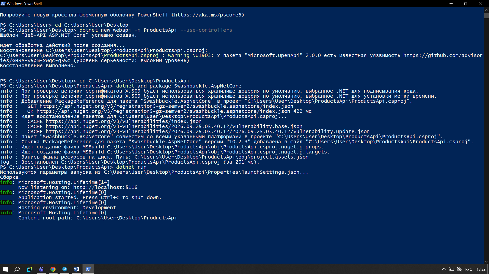

### 2. Swagger

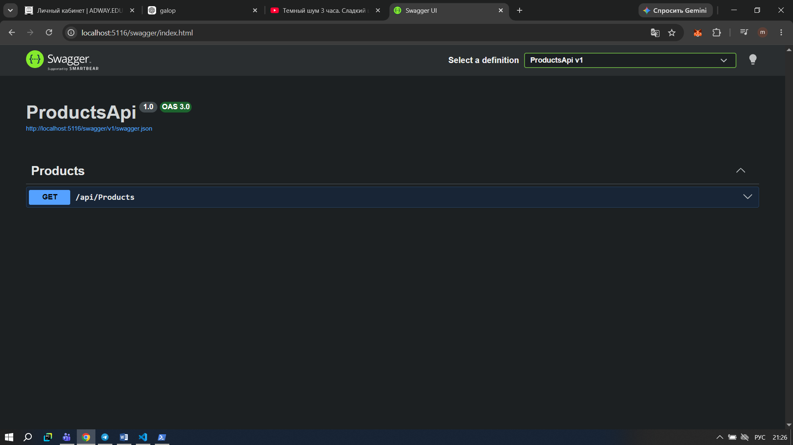

### 3. Ошибка Dependency Injection

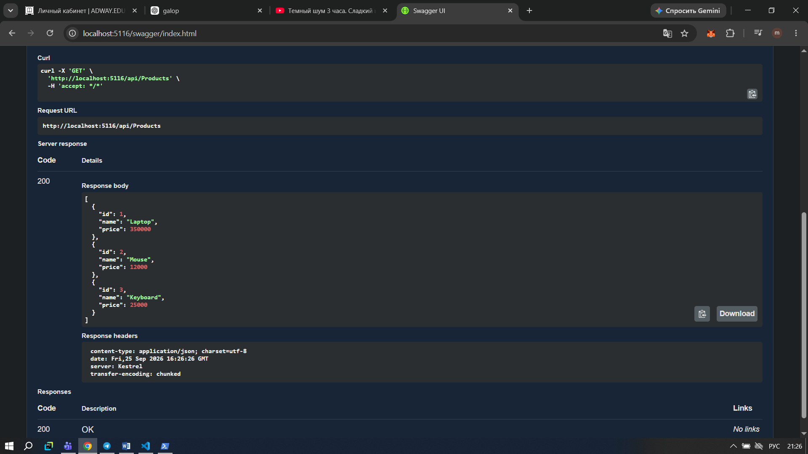

### 4. Получение всех товаров

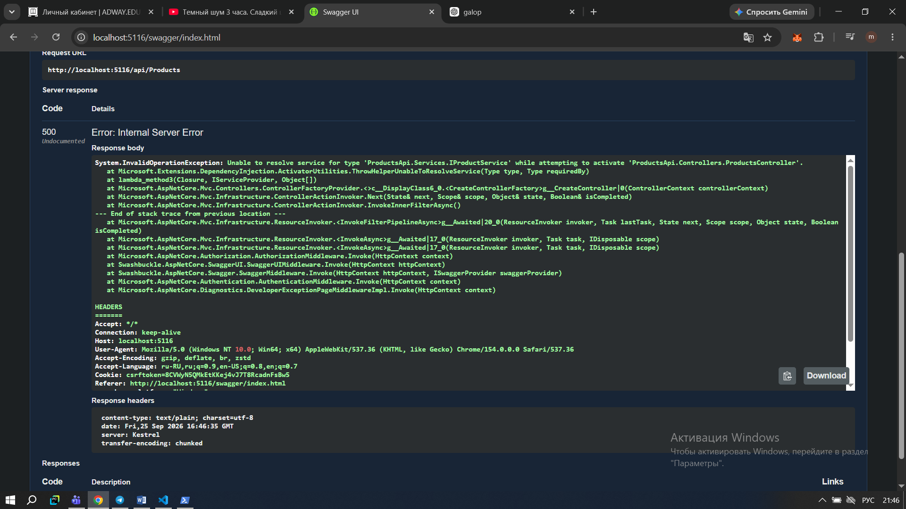

### 5. Получение товара с ID 1

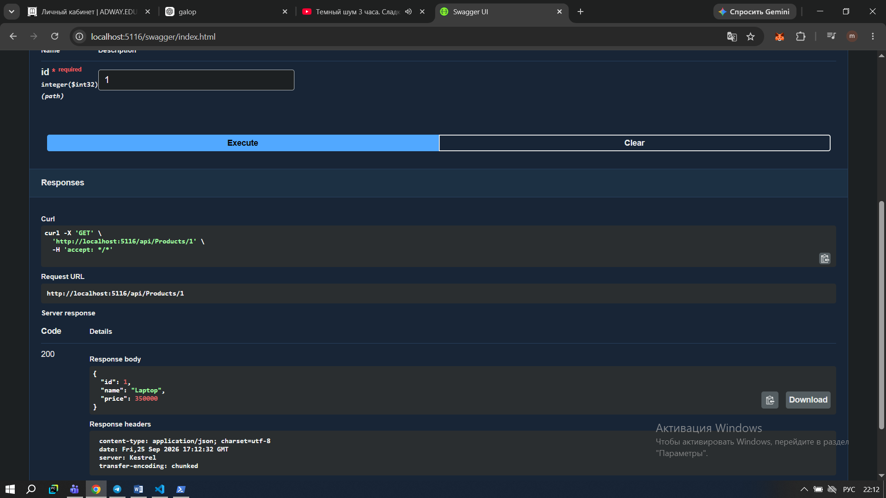

### 6. Получение отсутствующего товара

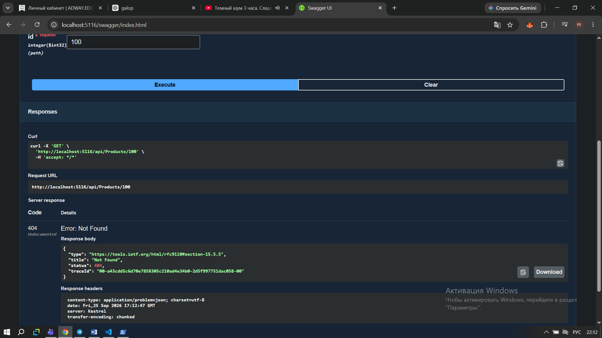

### 7. GET всех товаров с логированием

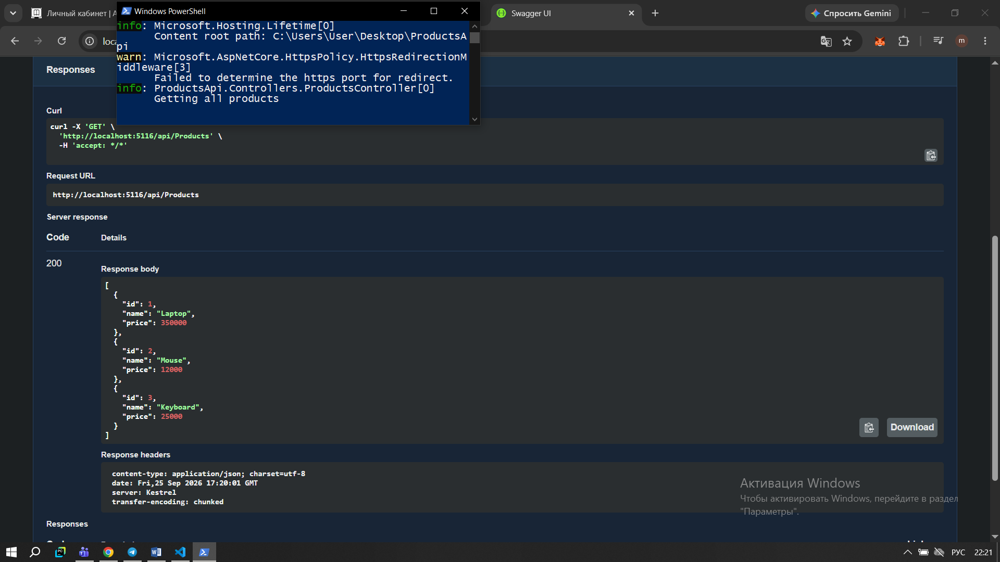

### 8. GET товара с ID 1 с логированием

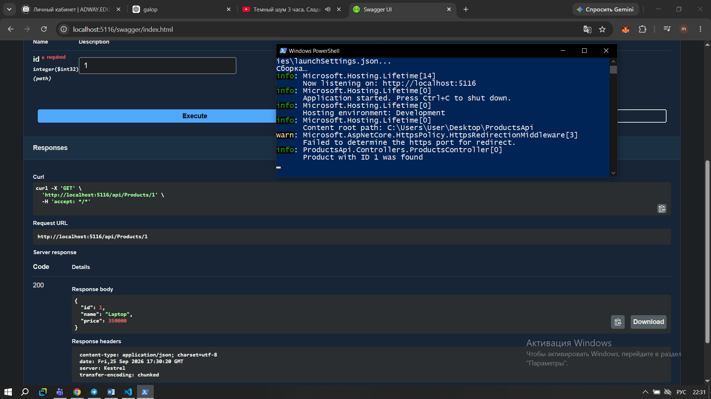

### 9. GET отсутствующего товара с Warning

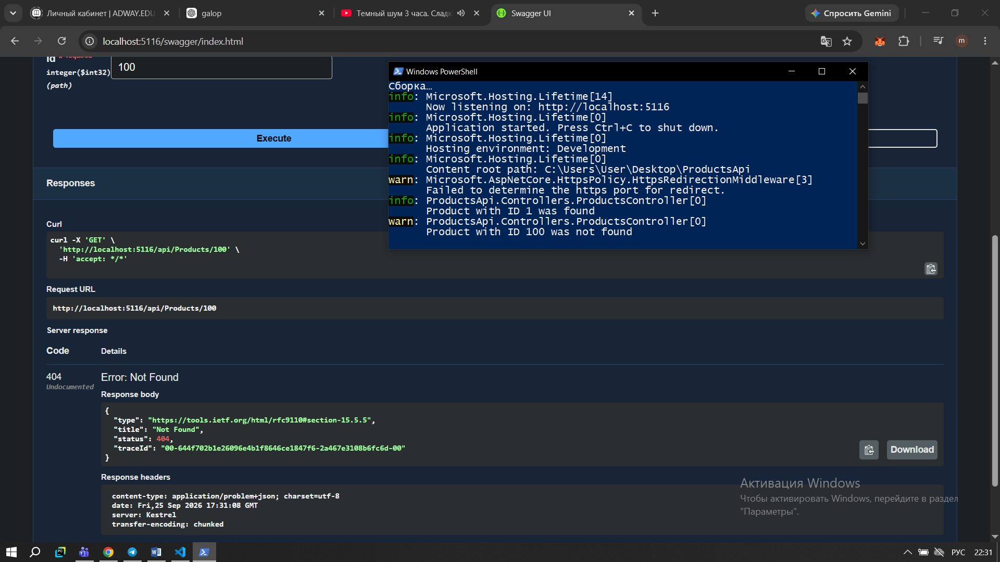

### 10. Уровни логирования

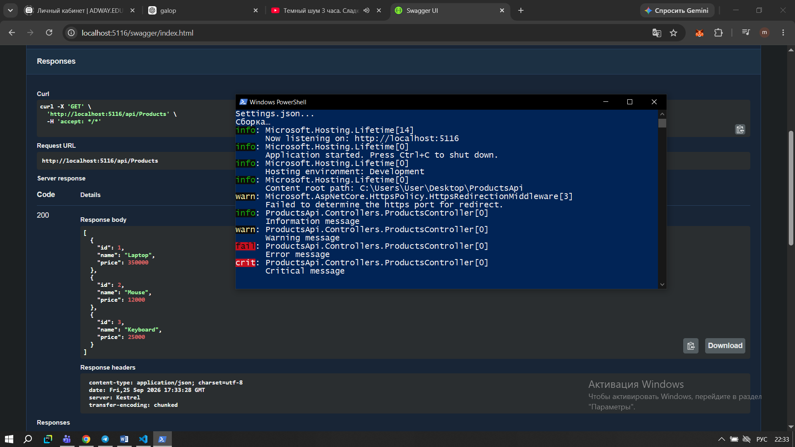

### 11. Логирование с уровнем Warning

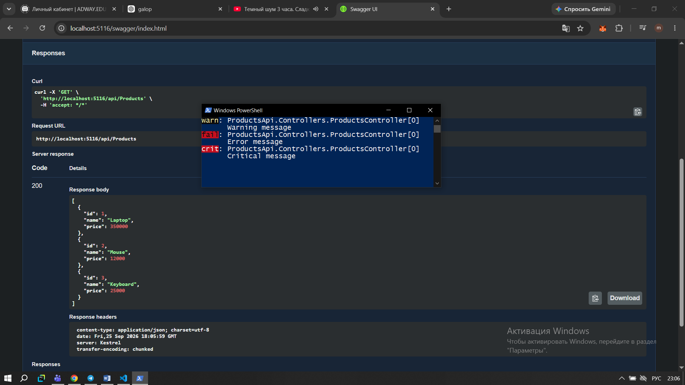

### 12. Возвращение уровня Information

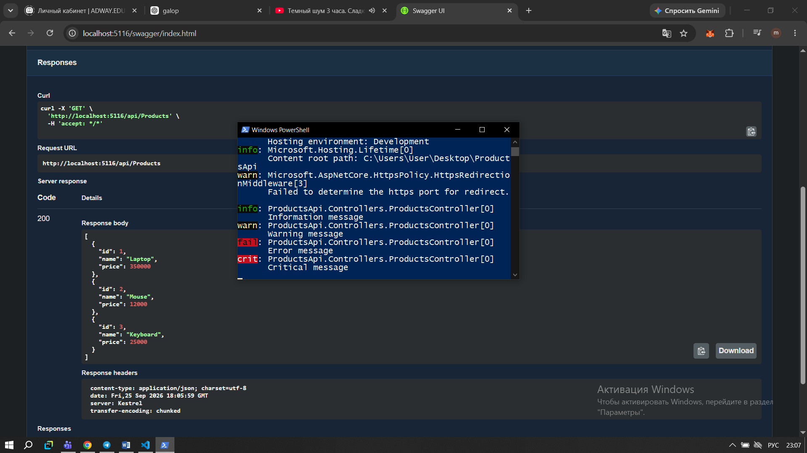

---

## 13. Контрольные вопросы

### 1. Что такое Dependency Injection?

Dependency Injection — это способ передачи необходимых объектов в класс извне, вместо того чтобы создавать их непосредственно внутри класса.

### 2. В чём проблема создания `new ProductService()` непосредственно в контроллере?

Контроллер становится напрямую зависимым от конкретного класса `ProductService`. Это усложняет изменение сервиса и тестирование контроллера.

### 3. Зачем нужен интерфейс `IProductService`?

Интерфейс описывает необходимые методы сервиса и позволяет контроллеру работать с абстракцией, а не с конкретной реализацией.

### 4. Что такое Constructor Injection?

Это способ внедрения зависимости через конструктор класса. ASP.NET Core автоматически передаёт необходимые зависимости при создании контроллера.

### 5. Зачем регистрировать сервис в `Program.cs`?

Чтобы DI-контейнер знал, какой конкретный класс нужно создавать, когда приложение получает запрос на `IProductService`.

### 6. Что делает `AddScoped`?

`AddScoped` регистрирует сервис с временем жизни в рамках одного HTTP-запроса. Для каждого нового запроса создаётся новый экземпляр сервиса.

### 7. Что такое `ILogger<T>`?

`ILogger<T>` — это стандартный механизм ASP.NET Core для записи сообщений о работе приложения.

### 8. Чем отличаются Information, Warning и Error?

`Information` используется для обычных информационных сообщений, `Warning` показывает потенциально проблемные ситуации, а `Error` сообщает об ошибках.

### 9. Для чего нужен `appsettings.json`?

В `appsettings.json` хранятся настройки приложения, в том числе настройки уровней логирования.

### 10. Почему слабая связанность упрощает изменение и тестирование кода?

Если классы зависят от интерфейсов, а не от конкретных реализаций, отдельные части программы можно проще заменять, изменять и тестировать.

---

## Вывод

В ходе практической работы я разобралась с принципом Dependency Injection в ASP.NET Core. Я создала интерфейс и сервис для работы с товарами, подключила сервис через constructor injection и зарегистрировала его в DI-контейнере.

Также я добавила `ILogger<ProductsController>` и проверила разные уровни логирования. На практике я увидела, что при изменении минимального уровня логирования сообщения с более низким приоритетом перестают отображаться.

В результате я получила более слабую связанность между контроллером и сервисом и лучше поняла, как DI и логирование используются в ASP.NET Core Web API.
