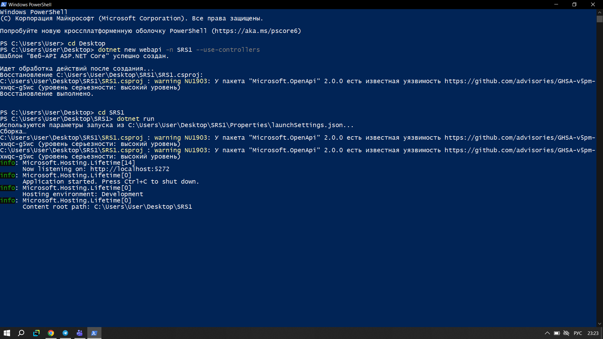
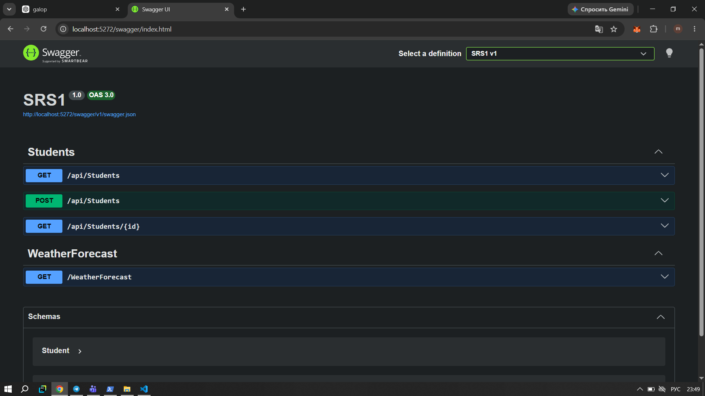
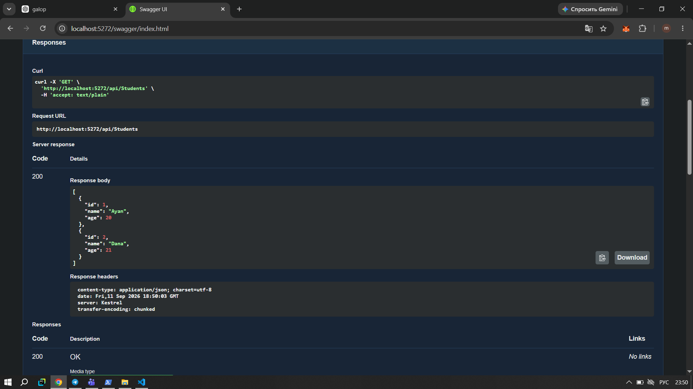
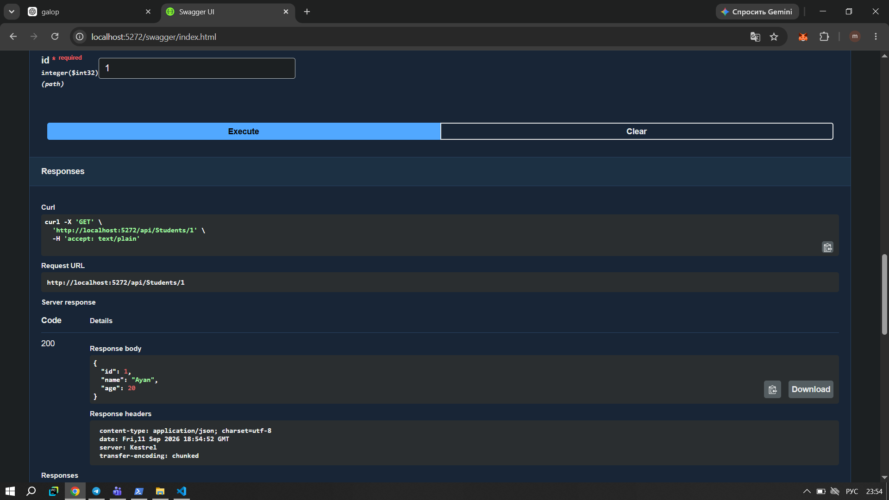
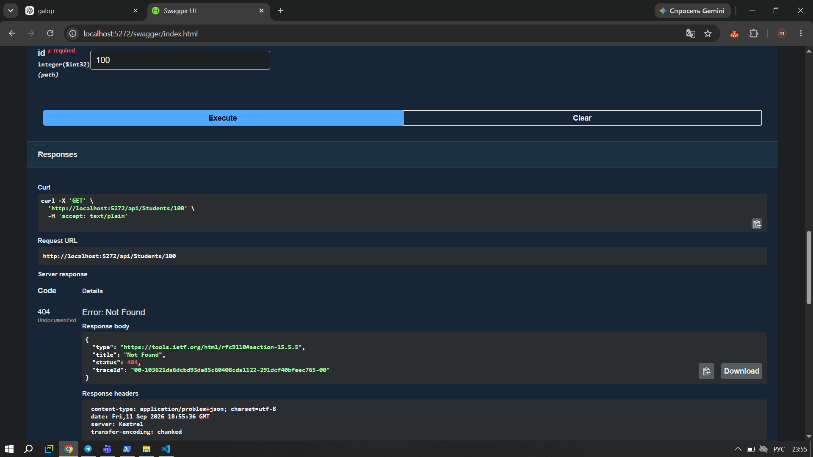
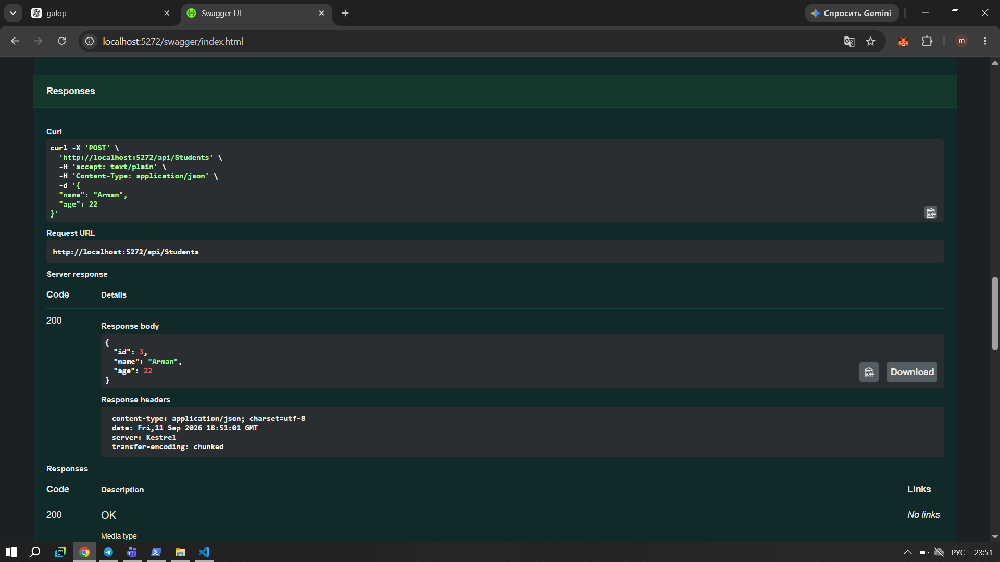
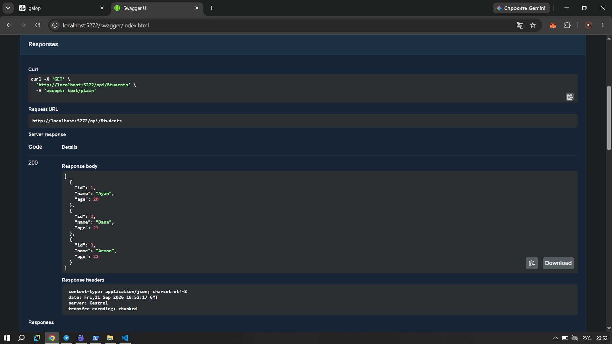

# SRS1 — Web API студентов

В этой работе я создала простое Web API на ASP.NET Core. API предназначено для работы со списком студентов. Для проверки запросов я использовала Swagger.

## 1. Создание и запуск проекта

Сначала я создала проект ASP.NET Core Web API с использованием контроллеров. После создания проекта запустила его через терминал и проверила, что приложение работает локально.



## 2. Проверка Swagger

После запуска проекта я открыла Swagger. В нём отображаются доступные методы API для работы со студентами: GET и POST.



## 3. Получение всех студентов

Для получения списка студентов я использовала GET-запрос:

`GET /api/Students`

После выполнения запроса сервер вернул список студентов. В начале в списке было два студента:

* Ayan — 20 лет
* Dana — 21 год

Ответ сервера имеет статус `200 OK`.



## 4. Получение студента по ID

Далее я проверила получение отдельного студента по его идентификатору:

`GET /api/Students/{id}`

Я указала ID `1`, после чего сервер вернул данные студента Ayan.

Ответ был получен со статусом `200 OK`.



## 5. Проверка ошибки 404

Также я проверила ситуацию, когда студент с указанным ID отсутствует.

Для проверки я использовала ID `100`. Такого студента в списке нет, поэтому сервер вернул статус `404 Not Found`.



## 6. Добавление нового студента

Для добавления нового студента я использовала POST-запрос:

`POST /api/Students`

В тело запроса передала данные нового студента:

```json
{
  "name": "Arman",
  "age": 22
}
```

После выполнения запроса студент был добавлен в список. Ему автоматически присвоился ID `3`.

Ответ сервера был получен со статусом `200 OK`.



## 7. Проверка списка после добавления

После добавления нового студента я снова выполнила GET-запрос для получения всего списка.

Теперь в списке стало три студента:

* Ayan — 20 лет
* Dana — 21 год
* Arman — 22 года

Таким образом, я проверила, что POST-запрос действительно добавил нового студента.



## Результат работы

В ходе работы я создала Web API на ASP.NET Core и реализовала основные запросы для работы со студентами.

Были проверены:

* получение всех студентов через GET;
* получение студента по ID;
* обработка ошибки `404 Not Found`;
* добавление нового студента через POST;
* повторное получение списка после добавления.

Все основные запросы были проверены через Swagger и работают корректно.
