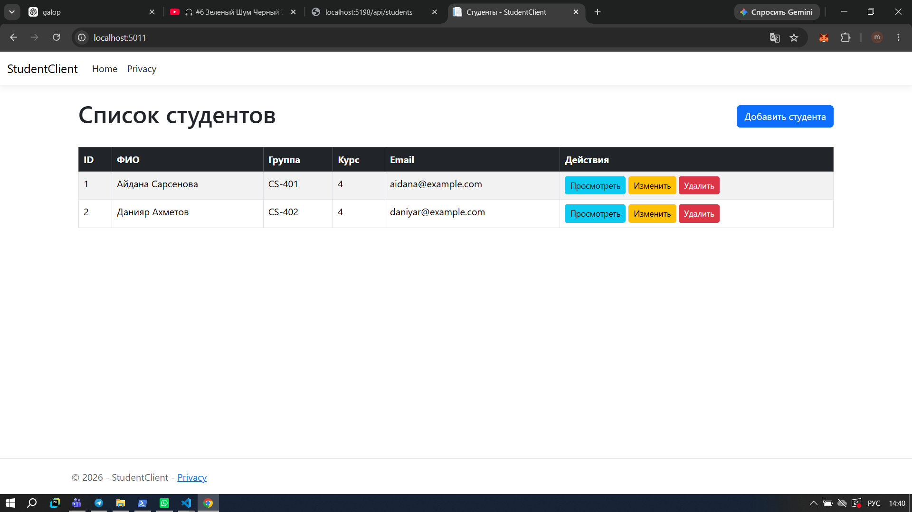
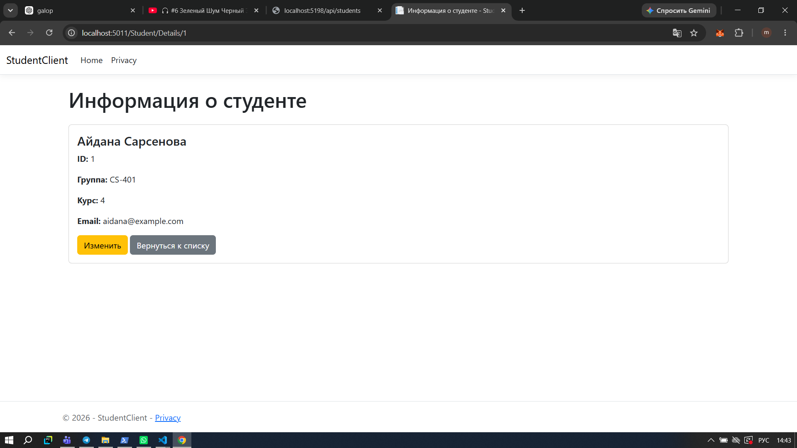
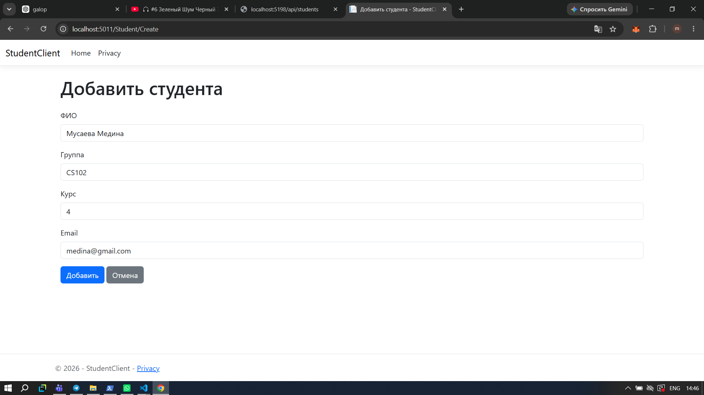
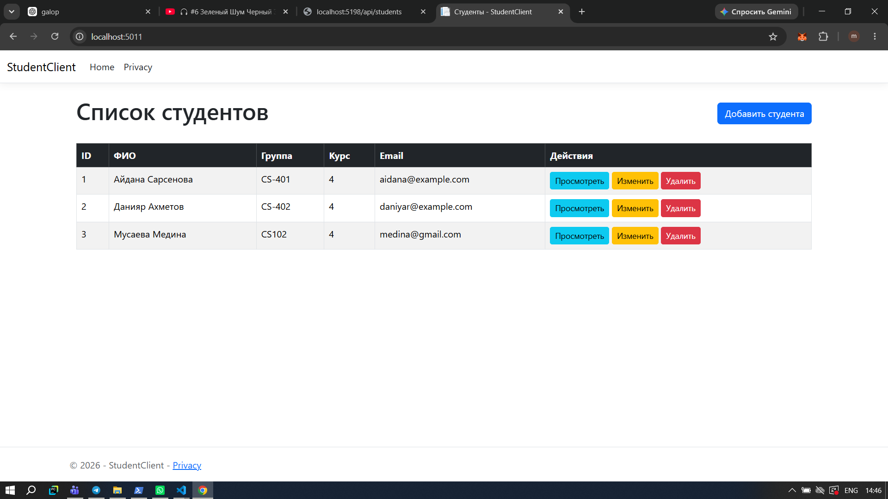
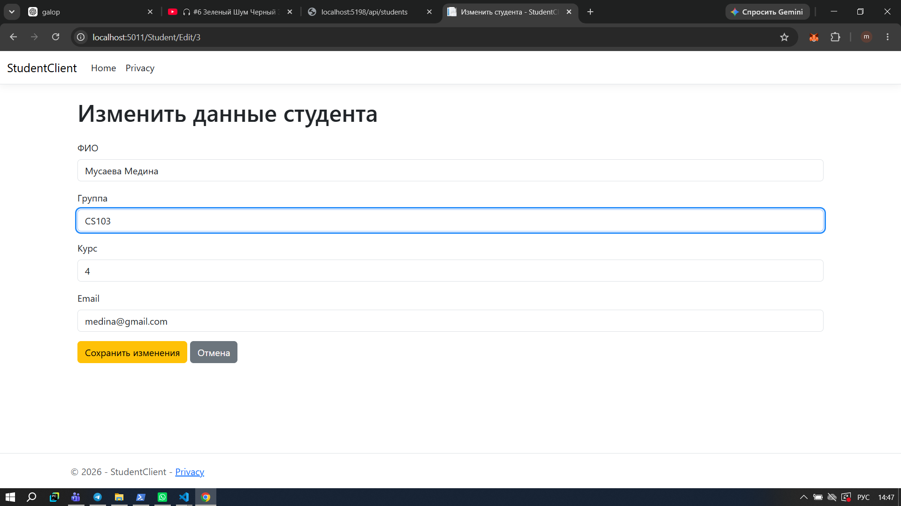
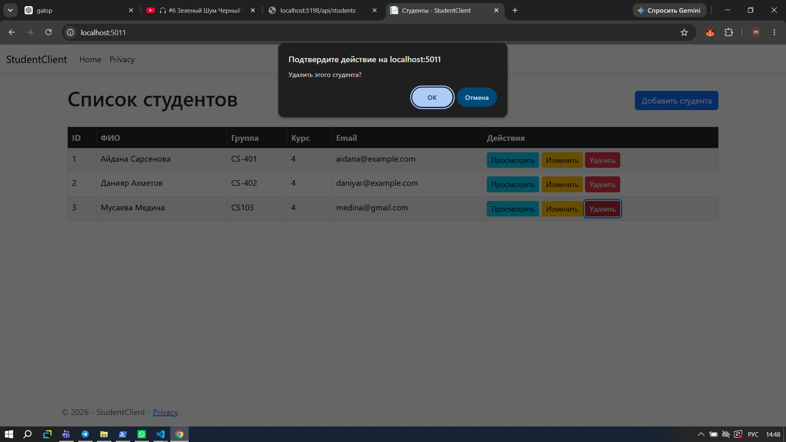
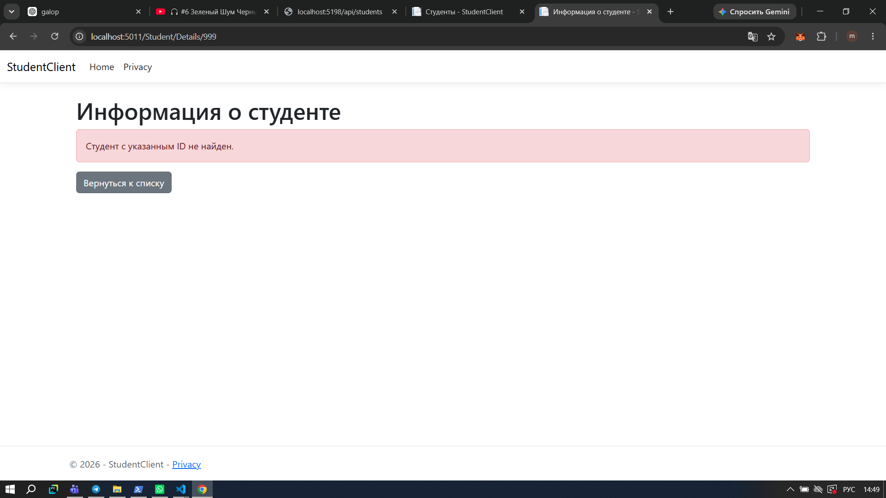
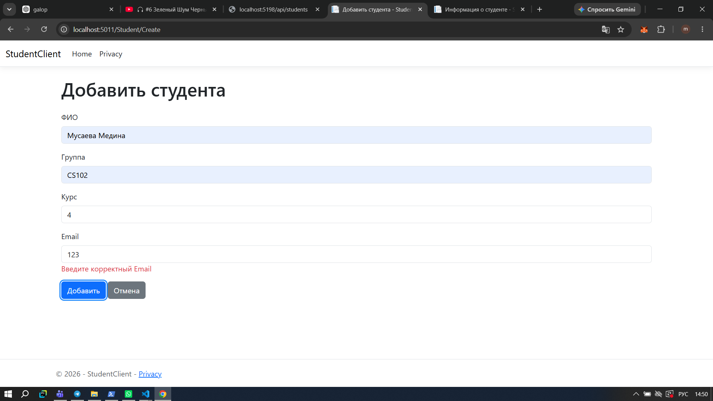

# Module 05 - Настройка использования Web API с помощью приложения ASP.NET Core

## 1. Общая информация

В данной практической работе были разработаны два ASP.NET Core приложения:

* **StudentApi** - Web API для работы с данными студентов;
* **StudentClient** - клиентское ASP.NET Core MVC-приложение, которое взаимодействует с Web API с помощью `HttpClient`.

Основная задача работы - научиться получать данные из Web API, добавлять, изменять и удалять записи через клиентское приложение, а также обрабатывать возможные ошибки при обращении к API.

Проекты разработаны на **C# и .NET 10**.

## 2. Структура работы

В GitHub-репозитории находятся два отдельных проекта:

```text
StudentApi/
StudentClient/
```

### StudentApi

`StudentApi` отвечает за серверную часть приложения.

В проекте реализованы:

* модель студента;
* получение списка студентов;
* получение одного студента по ID;
* добавление студента;
* изменение данных студента;
* удаление студента;
* проверка входных данных.

### StudentClient

`StudentClient` отвечает за пользовательскую часть приложения.

В нём реализованы:

* просмотр списка студентов;
* просмотр информации об отдельном студенте;
* добавление нового студента;
* изменение данных студента;
* удаление студента;
* обработка ситуации, когда студент не найден;
* отображение ошибок валидации;
* взаимодействие с Web API через `IHttpClientFactory` и `HttpClient`.

## 3. Модель Student

Для работы с данными используется модель `Student`.

Она содержит следующие поля:

| Поле     | Тип    | Описание                          |
| -------- | ------ | --------------------------------- |
| Id       | int    | Уникальный идентификатор студента |
| FullName | string | ФИО студента                      |
| Group    | string | Группа студента                   |
| Course   | int    | Курс обучения                     |
| Email    | string | Электронная почта                 |

Для полей `FullName`, `Group` и `Email` добавлена проверка обязательного заполнения.

Для `Course` установлено ограничение от 1 до 6.

Для `Email` используется проверка корректности адреса электронной почты.

## 4. StudentApi

Web API был создан как отдельный проект `StudentApi`.

Основной контроллер:

```text
Controllers/StudentsController.cs
```

Адрес API:

```text
http://localhost:5198
```

Основной маршрут:

```text
/api/students
```

### Реализованные методы

| HTTP-метод | Адрес                | Назначение                 |
| ---------- | -------------------- | -------------------------- |
| GET        | `/api/students`      | Получение списка студентов |
| GET        | `/api/students/{id}` | Получение студента по ID   |
| POST       | `/api/students`      | Добавление студента        |
| PUT        | `/api/students/{id}` | Изменение данных студента  |
| DELETE     | `/api/students/{id}` | Удаление студента          |

### GET - получение списка

При запросе:

```text
GET /api/students
```

API возвращает список студентов в формате JSON.

Пример ответа:

```json
[
  {
    "id": 1,
    "fullName": "Айдана Сарсенова",
    "group": "CS-401",
    "course": 4,
    "email": "aidana@example.com"
  },
  {
    "id": 2,
    "fullName": "Данияр Ахметов",
    "group": "CS-402",
    "course": 4,
    "email": "daniyar@example.com"
  }
]
```

После получения данных `StudentClient` отображает их в виде таблицы.

### Скриншот 1 - список студентов

На главной странице отображается список студентов, полученный из Web API. Для каждой записи доступны действия просмотра, изменения и удаления.



## 5. StudentClient и HttpClient

Для взаимодействия с API используется `IHttpClientFactory`.

В `Program.cs` зарегистрирован именованный HTTP-клиент:

```text
StudentApi
```

Для него установлен адрес Web API:

```text
http://localhost:5198/
```

Получение HTTP-клиента выполняется через:

```text
IHttpClientFactory
```

Основная логика работы с API находится в:

```text
Services/IStudentApiService.cs
Services/StudentApiService.cs
```

В интерфейсе определены методы:

```text
GetAllAsync()
GetByIdAsync(int id)
CreateAsync(Student student)
DeleteAsync(int id)
UpdateAsync(Student student)
```

`StudentApiService` выполняет HTTP-запросы к `StudentApi`.

Используются:

* `GET` для получения данных;
* `POST` для добавления;
* `PUT` для изменения;
* `DELETE` для удаления.

JSON преобразуется в объекты модели `Student`.

## 6. GET - получение студента по ID

Для просмотра отдельного студента используется действие `Details`.

При переходе к студенту выполняется запрос:

```text
GET /api/students/{id}
```

Если студент найден, отображается его подробная информация:

* ID;
* ФИО;
* группа;
* курс;
* Email.

### Скриншот 2 - информация о студенте

На странице отображается информация о выбранном студенте, полученная через запрос к Web API.



Если студент с указанным ID отсутствует, приложение показывает сообщение:

```text
Студент с указанным ID не найден.
```

Проверка этого случая выполнена для ID `999`.

## 7. POST - добавление нового студента

Для добавления используется отдельная форма.

Пользователь вводит:

* ФИО;
* группу;
* курс;
* Email.

После отправки формы `StudentClient` выполняет:

```text
POST /api/students
```

После успешного добавления происходит возврат к списку студентов.

### Скриншот 3 - добавление студента

На скриншоте показана форма, в которой вводятся данные нового студента перед отправкой в Web API.



В ходе проверки был добавлен студент:

```text
ФИО: Мусаева Медина
Группа: CS-102
Курс: 4
Email: medina@gmail.com
```

После отправки формы Web API создал новую запись.

### Скриншот 4 - добавленный студент

После успешного добавления студент появился в общем списке.



## 8. PUT - изменение данных студента

Для изменения используется кнопка `Изменить`.

Сначала приложение получает данные выбранного студента:

```text
GET /api/students/{id}
```

После этого данные отображаются в форме.

Можно изменить:

* ФИО;
* группу;
* курс;
* Email.

После сохранения выполняется:

```text
PUT /api/students/{id}
```

### Скриншот 5 - изменение студента

На скриншоте показана форма изменения данных существующего студента.



В ходе проверки группа студента была изменена с:

```text
CS-102
```

на:

```text
CS-103
```

После сохранения изменённые данные отобразились в списке.

## 9. DELETE - удаление студента

Для удаления используется кнопка `Удалить`.

После подтверждения выполняется запрос:

```text
DELETE /api/students/{id}
```

После успешного удаления пользователь возвращается к списку студентов.

В ходе проверки добавленная ранее запись была удалена, после чего она перестала отображаться в списке.

### Скриншот 6 - удаление студента

На скриншоте показан результат удаления студента из списка.



## 10. Обработка HTTP-статусов и ошибок

В приложении предусмотрена обработка результатов HTTP-запросов.

Используются следующие статусы:

| Статус                    | Назначение                 |
| ------------------------- | -------------------------- |
| 200 OK                    | Успешное получение данных  |
| 201 Created               | Успешное создание студента |
| 400 Bad Request           | Некорректные данные        |
| 404 Not Found             | Студент не найден          |
| 500 Internal Server Error | Ошибка на стороне сервера  |

В `StudentApiService` используются проверки статуса ответа и `try-catch`.

Если запрос не выполняется или API недоступно, приложение не завершается с ошибкой. Вместо этого пользователь получает безопасный результат или сообщение об ошибке.

## 11. Обработка ситуации, когда студент не найден

Если пользователь открывает страницу студента с ID, которого нет в API, метод `GetByIdAsync()` возвращает `null`.

Контроллер проверяет результат и выводит сообщение:

```text
Студент с указанным ID не найден.
```

### Скриншот 7 - студент не найден

Проверка выполнена с несуществующим ID `999`.



## 12. Валидация данных

В модели `Student` добавлены атрибуты валидации.

Проверяется:

* обязательное заполнение ФИО;
* обязательное заполнение группы;
* корректность курса;
* обязательное заполнение Email;
* корректность формата Email.

Для курса используется диапазон:

```text
1-6
```

В ходе проверки была введена некорректная комбинация данных:

```text
Курс: 10
Email: abc
```

Приложение показало сообщения об ошибках и не отправило некорректные данные.

### Скриншот 8 - ошибка валидации

На скриншоте показаны сообщения об ошибках при вводе некорректного курса и Email.



## 13. Проверка работы приложения

В процессе выполнения практической работы были проверены основные операции:

1. Получение списка студентов.
2. Просмотр информации о студенте.
3. Добавление нового студента.
4. Проверка появления добавленного студента в списке.
5. Изменение данных студента.
6. Проверка сохранения изменений.
7. Удаление студента.
8. Проверка отсутствия удалённой записи.
9. Проверка ситуации с несуществующим ID.
10. Проверка валидации некорректных данных.

Все основные операции были выполнены успешно.

## 14. Как запустить проект

Сначала необходимо запустить Web API.

Перейти в папку:

```text
StudentApi
```

и выполнить:

```powershell
dotnet run
```

API запускается по адресу:

```text
http://localhost:5198
```

После этого необходимо запустить клиентское приложение.

Перейти в папку:

```text
StudentClient
```

и выполнить:

```powershell
dotnet run
```

После запуска клиентское приложение открывается в браузере.

Важно сначала запустить `StudentApi`, потому что `StudentClient` получает данные именно от него.

## 15. Структура StudentClient

Основные файлы клиентского приложения:

```text
StudentClient/
│
├── Controllers/
│   └── StudentController.cs
│
├── Models/
│   ├── ErrorViewModel.cs
│   └── Student.cs
│
├── Services/
│   ├── IStudentApiService.cs
│   └── StudentApiService.cs
│
├── Views/
│   └── Student/
│       ├── Create.cshtml
│       ├── Details.cshtml
│       ├── Edit.cshtml
│       └── Index.cshtml
│
├── Screenshots/
│   ├── 1_список_студентов.png
│   ├── 2_информация_о_студенте.png
│   ├── 3_добавление_студента.png
│   ├── 4_добавленный_студент.png
│   ├── 5_изменение_студента.png
│   ├── 6_удаление_студента.png
│   ├── 7_студент_не_найден.png
│   └── 8_ошибка_валидации.png
│
├── .gitignore
├── Program.cs
└── StudentClient.csproj
```

## 16. Используемые технологии

В работе использовались:

* C#;
* .NET 10;
* ASP.NET Core Web API;
* ASP.NET Core MVC;
* HTTP;
* REST API;
* `HttpClient`;
* `IHttpClientFactory`;
* JSON;
* Bootstrap;
* Data Annotations;
* Visual Studio Code.

## 17. Итог работы

В результате практической работы были созданы два связанных ASP.NET Core приложения.

`StudentApi` предоставляет REST API для работы с данными студентов, а `StudentClient` использует это API для отображения и изменения данных через веб-интерфейс.

Были реализованы основные CRUD-операции: получение, добавление, изменение и удаление студентов. Также была добавлена обработка ошибок, проверка входных данных и ситуация с отсутствующим студентом.

Таким образом, в работе я на практике настроила взаимодействие клиентского ASP.NET Core приложения с Web API через `HttpClient` и `IHttpClientFactory`.
