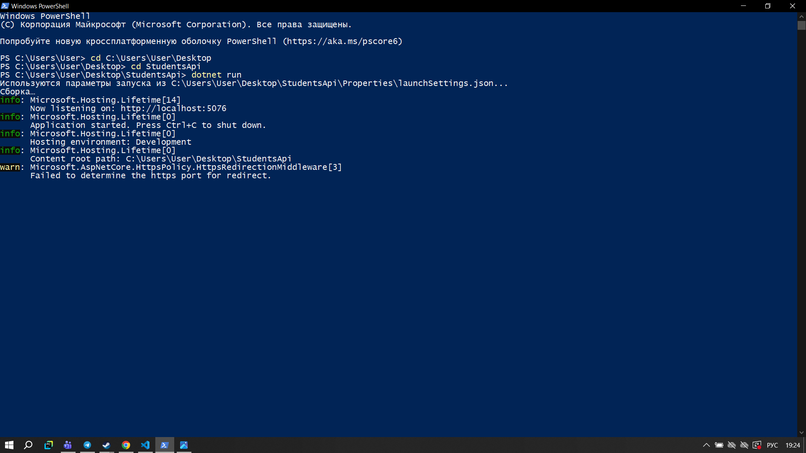
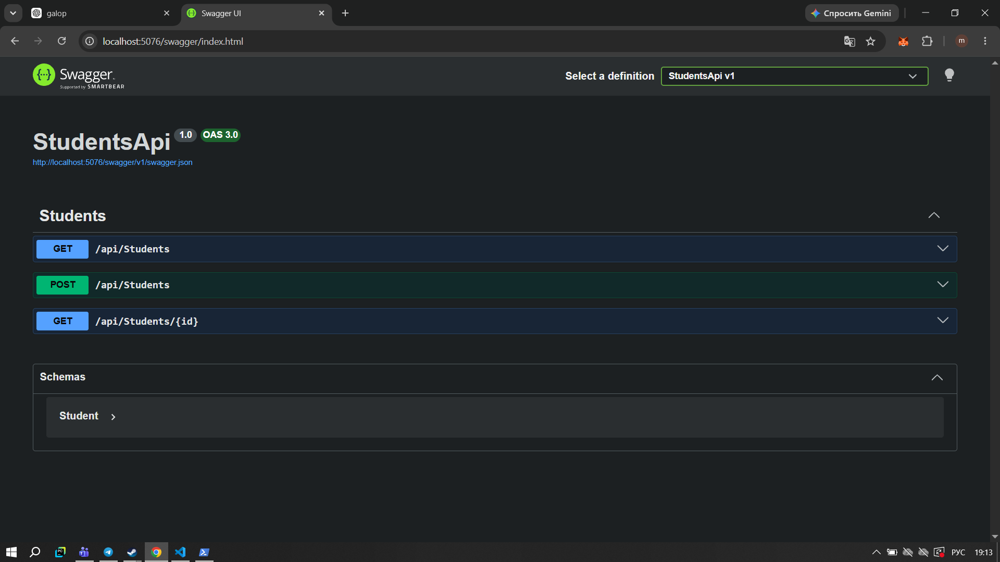
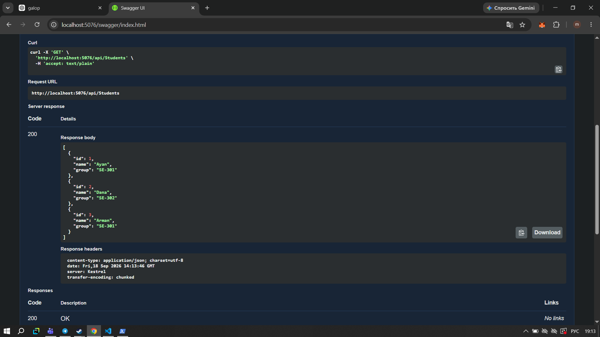
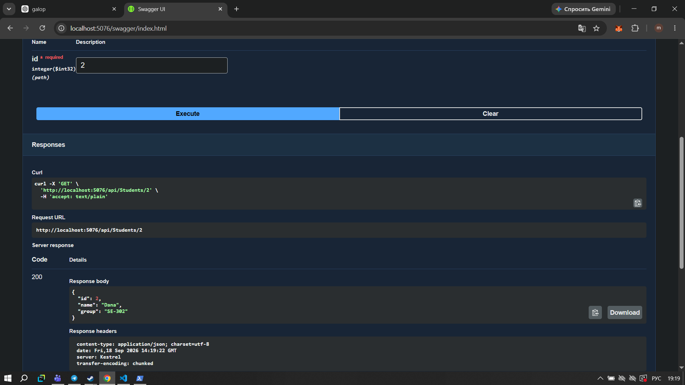
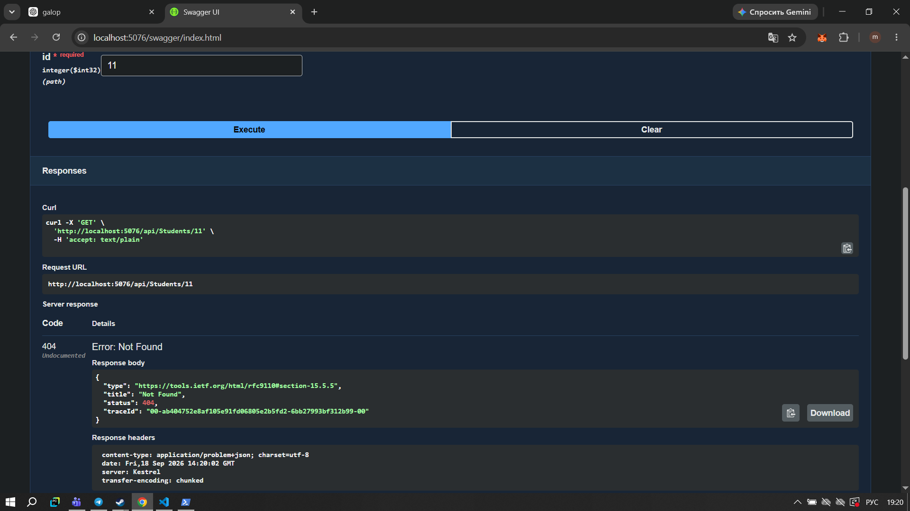
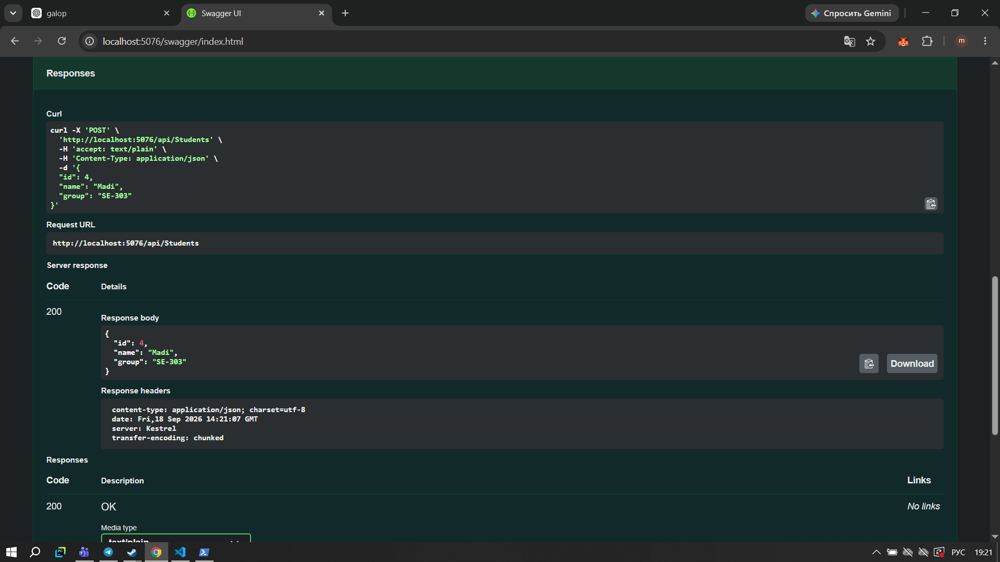

# Практическая работа — Модуль 02

## Тема

Реализация веб-сервиса с применением ASP.NET Core.

## Цель работы

В этой работе я создала простой Web API на ASP.NET Core для хранения информации о студентах. Я настроила контроллер, маршрутизацию и реализовала HTTP-методы GET и POST. Для проверки работы API я использовала Swagger.

## 1. Создание и запуск проекта

Сначала я создала проект ASP.NET Core Web API с использованием контроллеров. После запуска проекта проверила, что приложение работает локально.



Проект запустился на локальном адресе, после чего я открыла Swagger UI для тестирования API.

## 2. Swagger UI

В Swagger отображаются созданные методы для работы со студентами:

* GET `/api/Students`
* GET `/api/Students/{id}`
* POST `/api/Students`



Swagger позволяет выполнять запросы и сразу видеть ответы сервера.

## 3. Получение списка студентов

Для получения всех студентов я использовала GET-запрос:

`GET /api/Students`

После выполнения запроса сервер вернул список из трёх студентов:

* Ayan — SE-301
* Dana — SE-302
* Arman — SE-301

Ответ был получен со статусом `200 OK`.



## 4. Получение студента по ID

Далее я проверила получение одного студента по его идентификатору:

`GET /api/Students/{id}`

В качестве ID я указала `2`. Сервер вернул информацию о студенте Dana.

Ответ был получен со статусом `200 OK`.



## 5. Проверка ошибки 404

Также я проверила ситуацию, когда студента с указанным ID нет в списке.

Для проверки я указала ID `11`. Такого студента нет, поэтому сервер вернул:

`404 Not Found`



Таким образом, я проверила обработку ситуации с отсутствующим студентом.

## 6. Добавление нового студента

Для добавления нового студента я использовала POST-запрос:

`POST /api/Students`

В тело запроса передала данные:

```json
{
  "id": 4,
  "name": "Madi",
  "group": "SE-303"
}
```

После выполнения запроса сервер вернул добавленного студента.

Ответ был получен со статусом `200 OK`.



## 7. Проверка списка после добавления

После POST-запроса я снова выполнила:

`GET /api/Students`

В результате в списке появился новый студент Madi. Теперь список содержит четыре записи:

* Ayan — SE-301
* Dana — SE-302
* Arman — SE-301
* Madi — SE-303


Это показало, что новый студент действительно был добавлен в список.

## Результат работы

В ходе практической работы я создала простой Web API на ASP.NET Core для работы с данными студентов.

Я реализовала и проверила:

* получение списка студентов через GET;
* получение студента по ID;
* обработку ошибки `404 Not Found`;
* добавление студента через POST;
* повторное получение списка после добавления;
* тестирование API через Swagger UI.

Все необходимые методы API были проверены и работают корректно.
