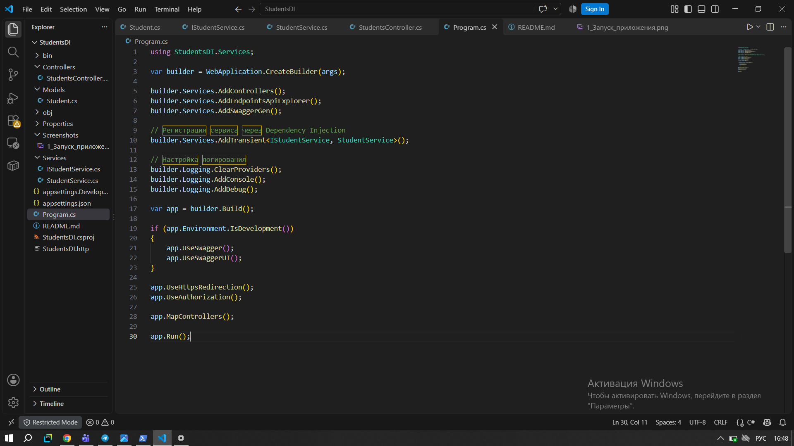
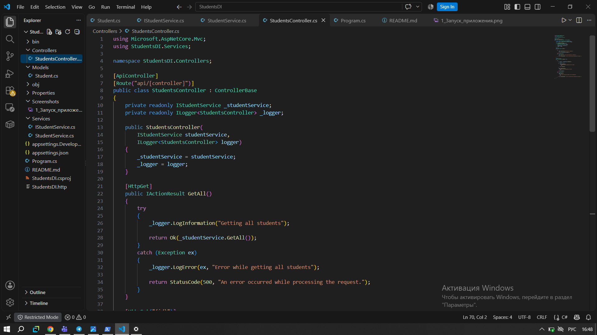
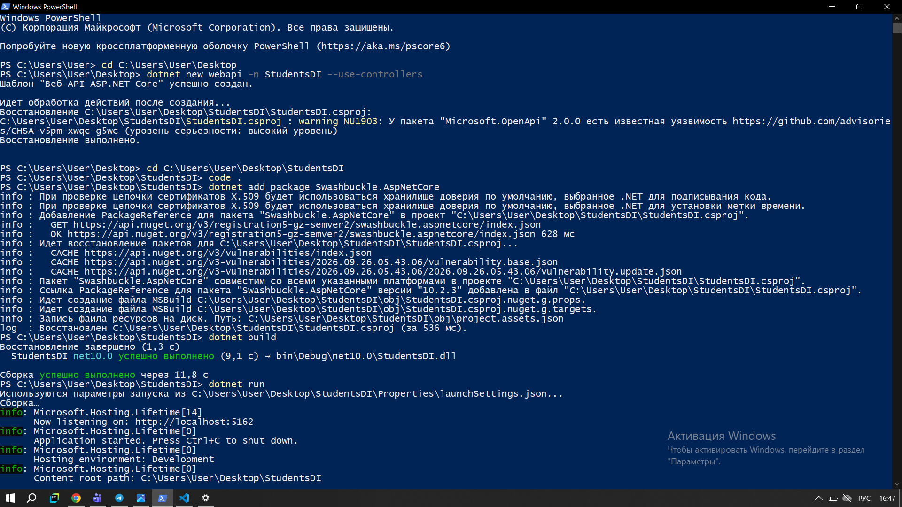
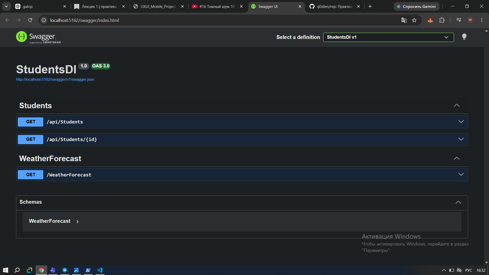
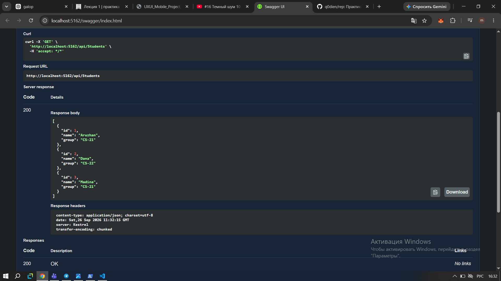
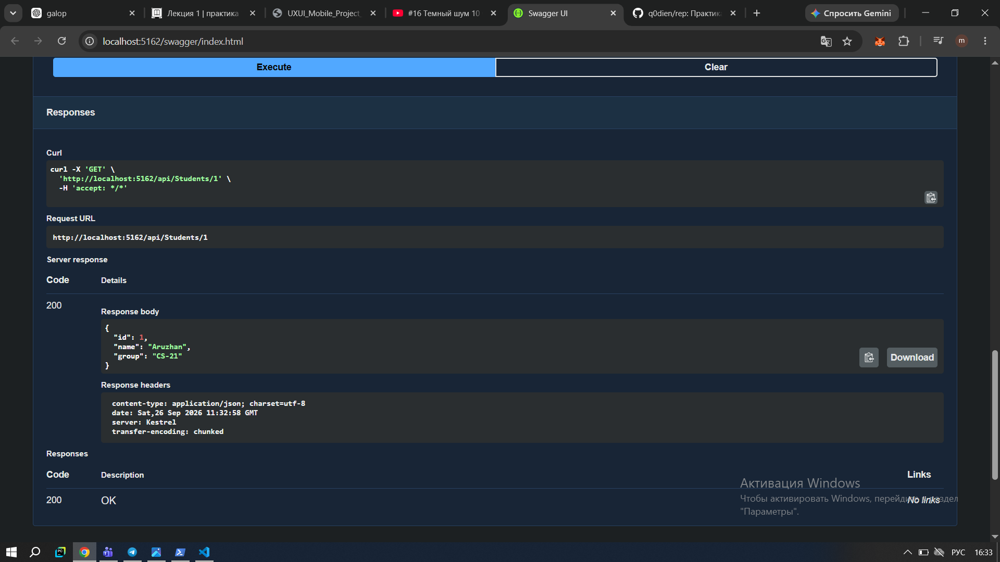
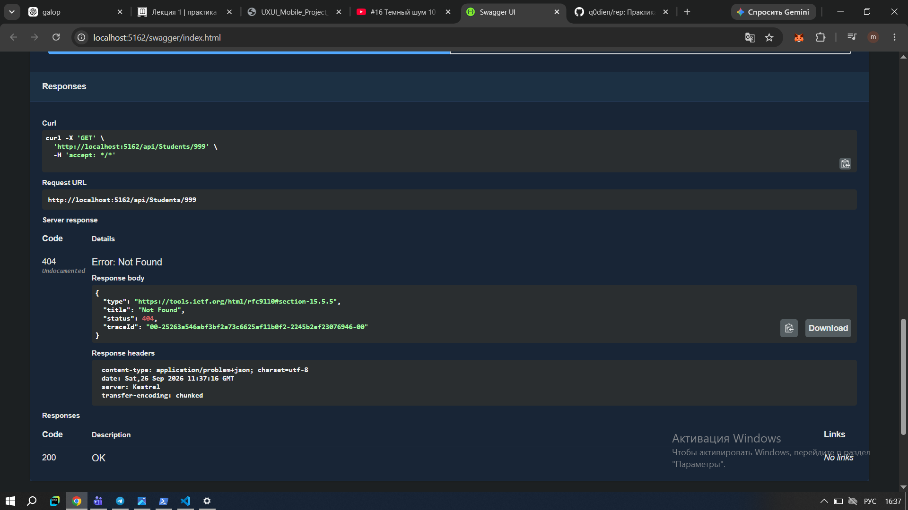
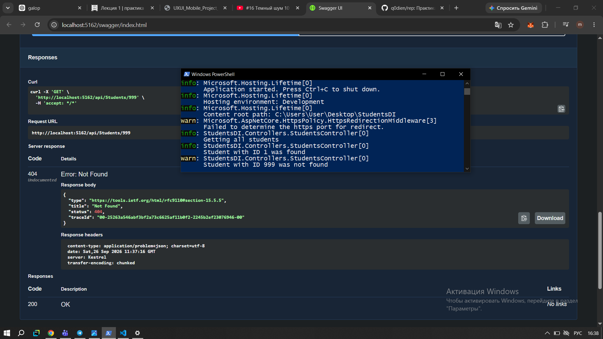
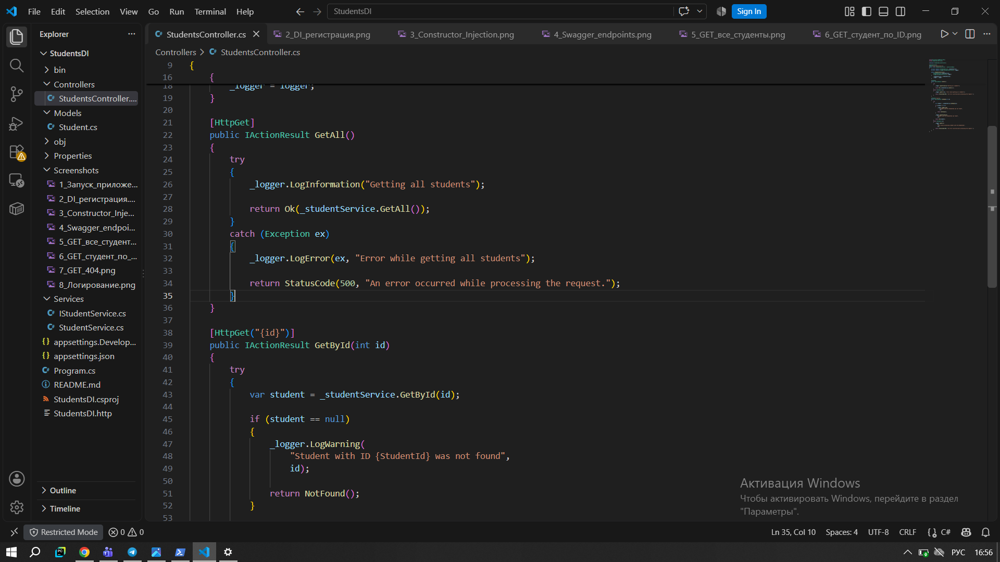
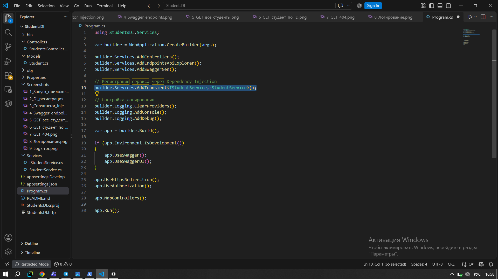

# StudentsDI — Dependency Injection и логирование

## 1. Описание работы

В рамках самостоятельной работы по модулю 03 я разработала веб-сервис на ASP.NET Core для получения информации о студентах.

Основная часть работы посвящена изучению **Dependency Injection (DI)** и логирования в ASP.NET Core. Я создала отдельный сервис для работы со студентами, интерфейс для этого сервиса и подключила его к контроллеру через Dependency Injection.

Также в контроллере используется `ILogger`, с помощью которого можно отслеживать выполнение запросов и возникающие проблемы.

Для проверки работы API я использовала Swagger.

---

## 2. Цель работы

Цель работы — на практике изучить:

* принцип Dependency Injection в ASP.NET Core;
* использование интерфейсов и сервисов;
* регистрацию зависимостей в `Program.cs`;
* Constructor Injection;
* использование `ILogger<T>`;
* уровни логирования `Information`, `Warning` и `Error`;
* обработку ситуации, когда студент не найден.

---

## 3. Используемые технологии

В работе использовались:

* C#
* ASP.NET Core
* .NET 10
* Swagger / Swashbuckle
* Dependency Injection
* ILogger
* Visual Studio Code

---

## 4. Структура проекта

```text
StudentsDI
│
├── Controllers
│   └── StudentsController.cs
│
├── Models
│   └── Student.cs
│
├── Services
│   ├── IStudentService.cs
│   └── StudentService.cs
│
├── Screenshots
│
├── Program.cs
├── README.md
└── StudentsDI.csproj
```

### Назначение основных файлов

* `Models/Student.cs` — модель студента.
* `Services/IStudentService.cs` — интерфейс сервиса.
* `Services/StudentService.cs` — реализация сервиса.
* `Controllers/StudentsController.cs` — контроллер API.
* `Program.cs` — регистрация зависимостей и настройка приложения.
* `Screenshots/` — скриншоты выполнения и проверки работы.

---

## 5. Создание модели Student

Для хранения данных о студентах я создала модель `Student`.

```csharp
public class Student
{
    public int Id { get; set; }

    public string Name { get; set; } = string.Empty;

    public string Group { get; set; } = string.Empty;
}
```

Модель содержит три свойства:

| Свойство | Тип      | Назначение             |
| -------- | -------- | ---------------------- |
| `Id`     | `int`    | Идентификатор студента |
| `Name`   | `string` | Имя студента           |
| `Group`  | `string` | Учебная группа         |

---

## 6. Создание интерфейса IStudentService

После создания модели я создала интерфейс `IStudentService`.

```csharp
public interface IStudentService
{
    IEnumerable<Student> GetAll();

    Student? GetById(int id);
}
```

В интерфейсе определены два метода:

* `GetAll()` — получение всех студентов;
* `GetById(int id)` — получение студента по ID.

Интерфейс нужен для того, чтобы контроллер зависел не от конкретного класса, а от абстракции.

---

## 7. Реализация StudentService

Интерфейс реализуется классом `StudentService`.

Для проверки работы сервиса я добавила три тестовых записи:

| ID | Имя     | Группа |
| -: | ------- | ------ |
|  1 | Aruzhan | CS-21  |
|  2 | Dana    | CS-22  |
|  3 | Madina  | CS-21  |

Метод `GetAll()` возвращает весь список студентов.

Метод `GetById()` выполняет поиск по идентификатору. Если студент с таким ID отсутствует, метод возвращает `null`.

---

## 8. Регистрация Dependency Injection

Для подключения сервиса к приложению я зарегистрировала его в `Program.cs`:

```csharp
builder.Services.AddTransient<IStudentService, StudentService>();
```

`AddTransient` означает, что при запросе зависимости контейнер Dependency Injection создаёт новый экземпляр сервиса.

Так как `IStudentService` связан с `StudentService`, ASP.NET Core знает, какой объект нужно передать контроллеру.

### Скриншот регистрации DI



---

## 9. Constructor Injection

В `StudentsController` сервис передаётся через конструктор:

```csharp
public StudentsController(
    IStudentService studentService,
    ILogger<StudentsController> logger)
{
    _studentService = studentService;
    _logger = logger;
}
```

Также зависимости сохраняются в приватных полях:

```csharp
private readonly IStudentService _studentService;
private readonly ILogger<StudentsController> _logger;
```

Таким образом, контроллер не создаёт `StudentService` самостоятельно через `new`. Необходимые объекты передаются ему через Dependency Injection.

### Скриншот Constructor Injection



---

## 10. Логирование

Для логирования в контроллер был добавлен:

```csharp
ILogger<StudentsController>
```

В работе используются три уровня логирования.

### LogInformation

Используется для обычных событий.

Например:

```csharp
_logger.LogInformation("Getting all students");
```

Это сообщение появляется при запросе списка студентов.

### LogWarning

Используется, когда студент с указанным ID не найден:

```csharp
_logger.LogWarning(
    "Student with ID {StudentId} was not found",
    id);
```

### LogError

Используется для записи ошибок:

```csharp
_logger.LogError(
    ex,
    "Error while processing student with ID {StudentId}",
    id);
```

---

## 11. Запуск приложения

После завершения разработки я запустила приложение с помощью команды:

```text
dotnet run
```

Приложение запустилось на локальном адресе:

```text
http://localhost:5162
```

### Скриншот запуска



---

## 12. Swagger

Для тестирования API я использовала Swagger.

После запуска приложения Swagger доступен по адресу:

```text
http://localhost:5162/swagger
```

В Swagger отображаются два endpoint:

```text
GET /api/Students
GET /api/Students/{id}
```

### Скриншот Swagger



---

## 13. GET — получение всех студентов

Первым тестом я проверила получение списка всех студентов.

Запрос:

```text
GET /api/Students
```

В результате сервер возвращает статус:

```text
200 OK
```

и список из трёх студентов.

### Скриншот GET всех студентов



---

## 14. GET — получение студента по ID

Затем я проверила получение отдельного студента.

Запрос:

```text
GET /api/Students/1
```

Сервер возвращает:

```text
200 OK
```

и данные студента:

```json
{
  "id": 1,
  "name": "Aruzhan",
  "group": "CS-21"
}
```

### Скриншот GET по ID



---

## 15. Обработка отсутствующего студента

Для проверки обработки ошибки я отправила запрос с ID, которого нет в списке:

```text
GET /api/Students/999
```

Такого студента в сервисе нет, поэтому контроллер возвращает:

```text
404 Not Found
```

Одновременно в консоли появляется предупреждение:

```text
Student with ID 999 was not found
```

### Скриншот ответа 404



---

## 16. Проверка логирования

После выполнения запросов я проверила консоль приложения.

В ней отображаются сообщения разных уровней. Например, при получении списка студентов появляется `Information`, а при запросе несуществующего студента — `Warning`.

Это позволяет увидеть, какие действия выполняются в приложении.

### Скриншот логирования



---

## 17. Обработка ошибок через LogError

В контроллере операции получения студентов находятся внутри `try-catch`.

Если во время выполнения возникает исключение, оно записывается в журнал с помощью `LogError`:

```csharp
_logger.LogError(
    ex,
    "Error while processing student with ID {StudentId}",
    id);
```

После этого клиенту возвращается статус `500`.

### Скриншот LogError



---

## 18. Дополнительное задание: Transient и Singleton

В основном варианте работы используется:

```csharp
builder.Services.AddTransient<IStudentService, StudentService>();
```

В дополнительном задании я заменила регистрацию на:

```csharp
builder.Services.AddSingleton<IStudentService, StudentService>();
```

### Разница

`Transient` создаёт новый экземпляр сервиса каждый раз, когда он требуется.

`Singleton` создаёт один экземпляр сервиса на всё время работы приложения и использует его повторно.

В данном проекте разница практически не заметна при обычных GET-запросах, потому что сервис только предоставляет данные из списка студентов.

После проверки я вернула `AddTransient`, так как этот вариант указан в основном задании.

### Скриншот Singleton



---

# 19. Контрольные вопросы

### 1. Что такое Dependency Injection?

Dependency Injection — это способ передачи необходимых объектов классу извне. Вместо самостоятельного создания объекта через `new` класс получает готовую зависимость.

В моей работе `StudentsController` получает `IStudentService` через конструктор.

### 2. Почему используется интерфейс вместо `new`?

Интерфейс позволяет контроллеру не зависеть напрямую от конкретного класса `StudentService`.

Контроллер работает с `IStudentService`, а конкретная реализация указывается при регистрации в `Program.cs`.

Это позволяет при необходимости заменить реализацию сервиса без изменения контроллера.

### 3. Что такое Constructor Injection?

Constructor Injection — это передача зависимостей через конструктор класса.

В моей работе через конструктор `StudentsController` передаются:

* `IStudentService`;
* `ILogger<StudentsController>`.

ASP.NET Core автоматически предоставляет эти зависимости.

### 4. Почему сервис регистрируется в Program.cs?

Сервис регистрируется в `Program.cs`, чтобы контейнер Dependency Injection знал, какую реализацию использовать.

В моей работе:

```csharp
builder.Services.AddTransient<IStudentService, StudentService>();
```

связывает интерфейс `IStudentService` с классом `StudentService`.

### 5. Что такое ILogger<T>?

`ILogger<T>` — это инструмент для записи сообщений о работе приложения.

В моём проекте он используется в `StudentsController` для информационных сообщений, предупреждений и ошибок.

### 6. Чем отличаются LogInformation, LogWarning и LogError?

`LogInformation` используется для обычных событий приложения.

`LogWarning` используется для предупреждений, например если студент с указанным ID не найден.

`LogError` используется для записи ошибок, возникших во время выполнения операции.

---

# 20. Вывод

В ходе работы я разработала Web API для получения информации о студентах.

Я создала модель `Student`, интерфейс `IStudentService` и сервис `StudentService`. После этого зарегистрировала сервис через Dependency Injection и передала его в контроллер с помощью Constructor Injection.

Также я подключила `ILogger` и использовала разные уровни логирования для отслеживания работы приложения.

Работу API я проверила через Swagger: получила список студентов, получила студента по ID и проверила ситуацию с несуществующим ID, при которой возвращается `404 Not Found`.

Дополнительно я сравнила `Transient` и `Singleton` и посмотрела, как отличается время жизни создаваемого сервиса.
