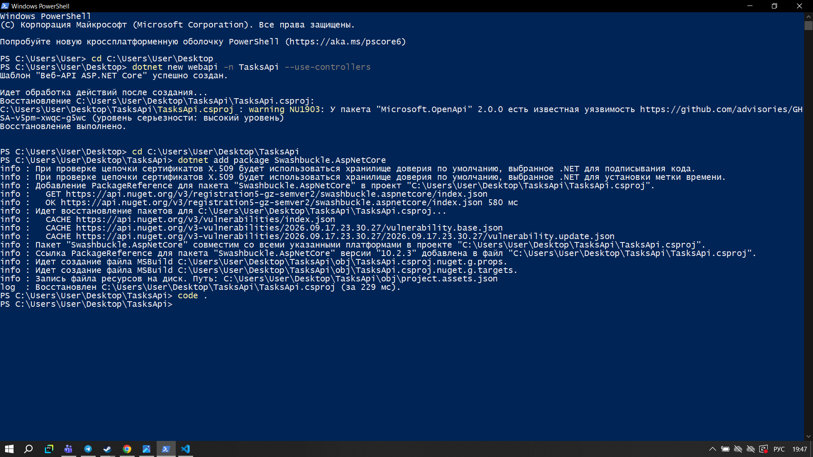
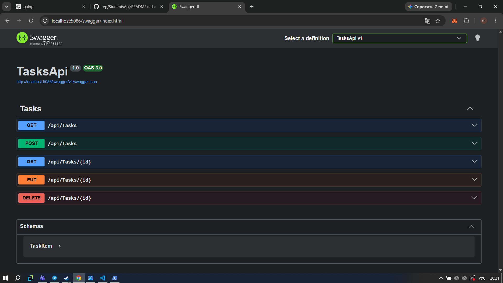
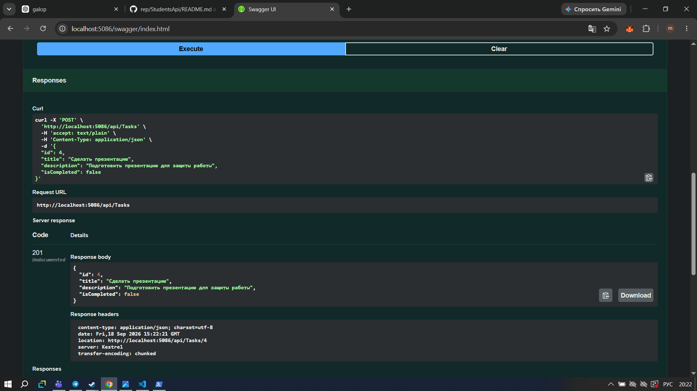
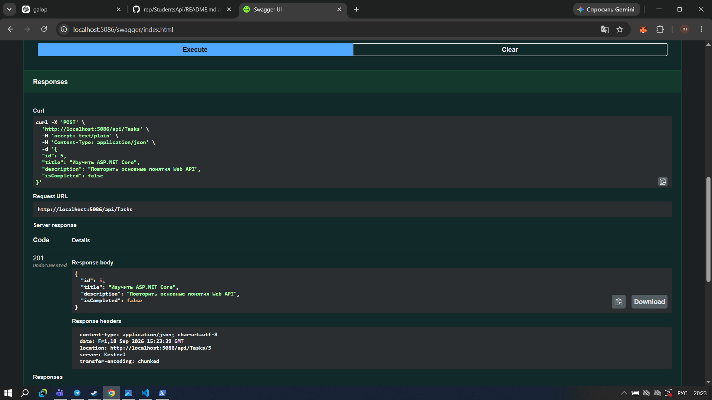
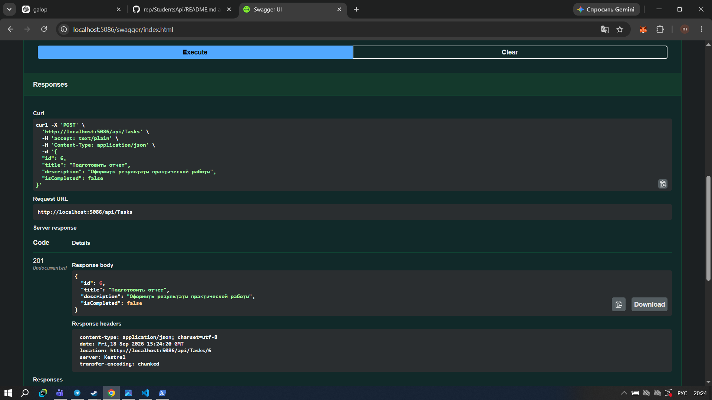
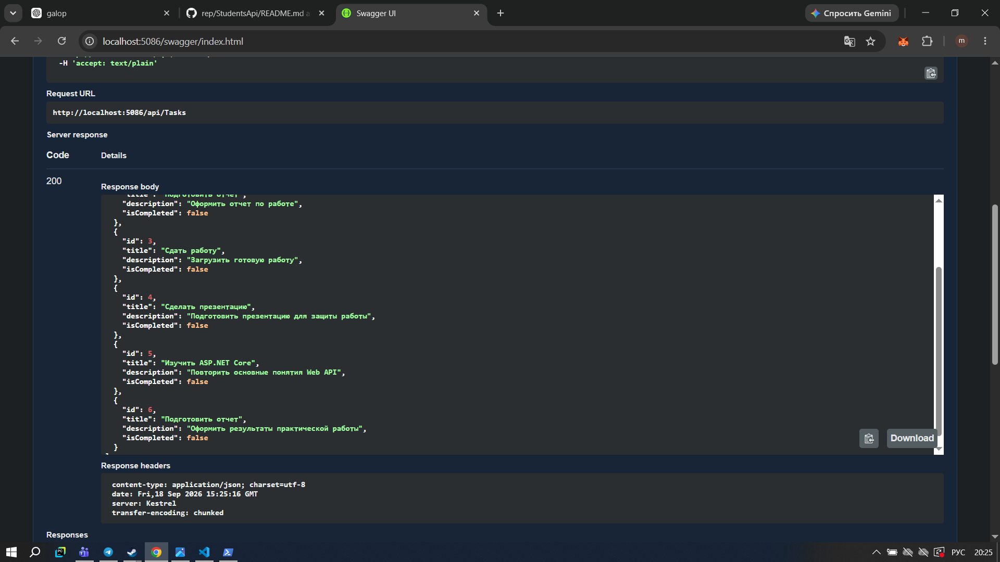
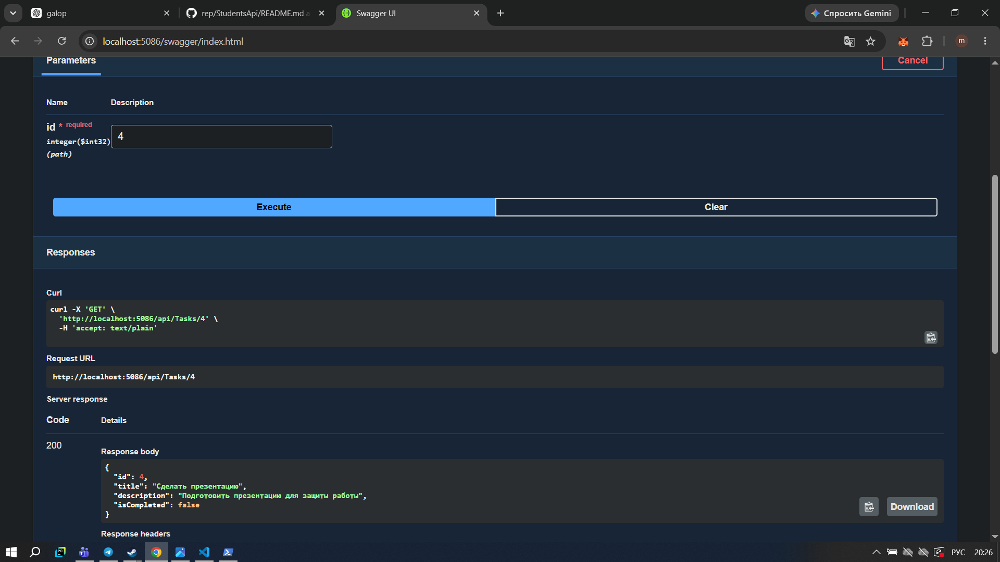
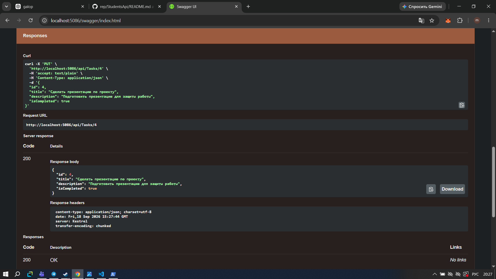
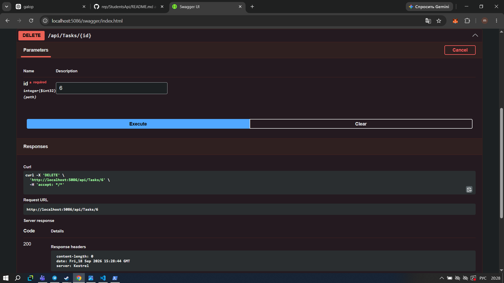
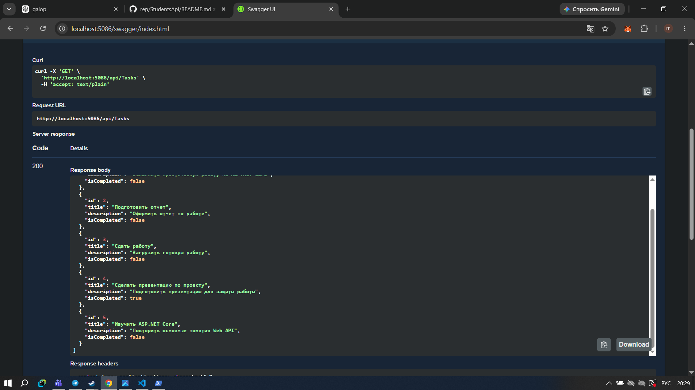

# Самостоятельная работа — Модуль 02

## Тема

Реализация веб-сервиса с применением ASP.NET Core.

## Цель работы

В этой работе я создала простой REST API на ASP.NET Core для управления списком задач. Я реализовала основные HTTP-методы GET, POST, PUT и DELETE, а также проверила работу API с помощью Swagger UI.

## 1. Создание и запуск проекта

Сначала я создала проект ASP.NET Core Web API с использованием контроллеров. После запуска проекта проверила, что приложение работает локально.

Проект запустился на адресе:

`http://localhost:5086`



После запуска я открыла Swagger UI для тестирования созданного API.

## 2. Swagger UI

В Swagger отображаются все реализованные методы для работы с задачами:

* GET `/api/Tasks`
* GET `/api/Tasks/{id}`
* POST `/api/Tasks`
* PUT `/api/Tasks/{id}`
* DELETE `/api/Tasks/{id}`



Swagger позволил мне выполнять запросы и сразу видеть ответы сервера.

## 3. Добавление первой задачи

Для добавления задачи я использовала POST-запрос:

`POST /api/Tasks`

В запросе я передала данные задачи:

```json
{
  "id": 4,
  "title": "Сделать презентацию",
  "description": "Подготовить презентацию для защиты работы",
  "isCompleted": false
}
```

Сервер успешно создал задачу и вернул статус `201 Created`.



## 4. Добавление второй задачи

Затем я добавила вторую задачу:

```json
{
  "id": 5,
  "title": "Изучить ASP.NET Core",
  "description": "Повторить основные понятия Web API",
  "isCompleted": false
}
```

Запрос также завершился успешно со статусом `201 Created`.



## 5. Добавление третьей задачи

После этого я добавила третью задачу:

```json
{
  "id": 6,
  "title": "Подготовить отчет",
  "description": "Оформить результаты практической работы",
  "isCompleted": false
}
```

Сервер вернул статус `201 Created`.



Таким образом, через POST я создала три новые задачи.

## 6. Получение всех задач

После добавления задач я выполнила GET-запрос:

`GET /api/Tasks`

Сервер вернул список всех задач со статусом `200 OK`.

На этом этапе в списке находилось шесть задач: три начальные и три добавленные через POST.



## 7. Получение задачи по ID

Далее я проверила получение отдельной задачи по идентификатору.

Я использовала запрос:

`GET /api/Tasks/4`

Сервер вернул информацию о задаче с ID 4 и статус `200 OK`.



## 8. Изменение задачи через PUT

После этого я проверила изменение существующей задачи.

Я использовала:

`PUT /api/Tasks/4`

Название задачи было изменено на:

`Сделать презентацию по проекту`

Также значение `isCompleted` было изменено на `true`.

Сервер вернул обновлённые данные со статусом `200 OK`.



## 9. Удаление задачи

Для проверки удаления я использовала:

`DELETE /api/Tasks/6`

Таким образом была удалена задача с ID 6.

Запрос выполнился успешно. Сервер вернул статус `200 OK`.



## 10. Проверка изменений

В конце я снова выполнила:

`GET /api/Tasks`

Сервер вернул список со статусом `200 OK`.

В результате задача с ID 6 больше не отображалась, а изменения задачи с ID 4 сохранились.



## Результат работы

В ходе самостоятельной работы я создала REST API на ASP.NET Core для управления списком задач.

Я реализовала и проверила следующие операции:

* создание задач через POST;
* получение всех задач через GET;
* получение задачи по ID;
* изменение задачи через PUT;
* удаление задачи через DELETE;
* проверку результата после изменения и удаления.

Для тестирования API я использовала Swagger UI.

В результате получилось веб-приложение, которое позволяет создавать, получать, изменять и удалять задачи без использования базы данных.
