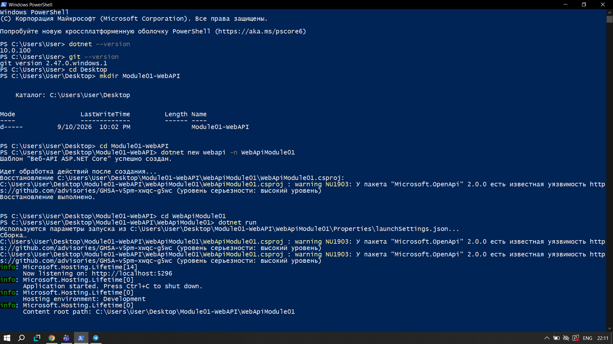
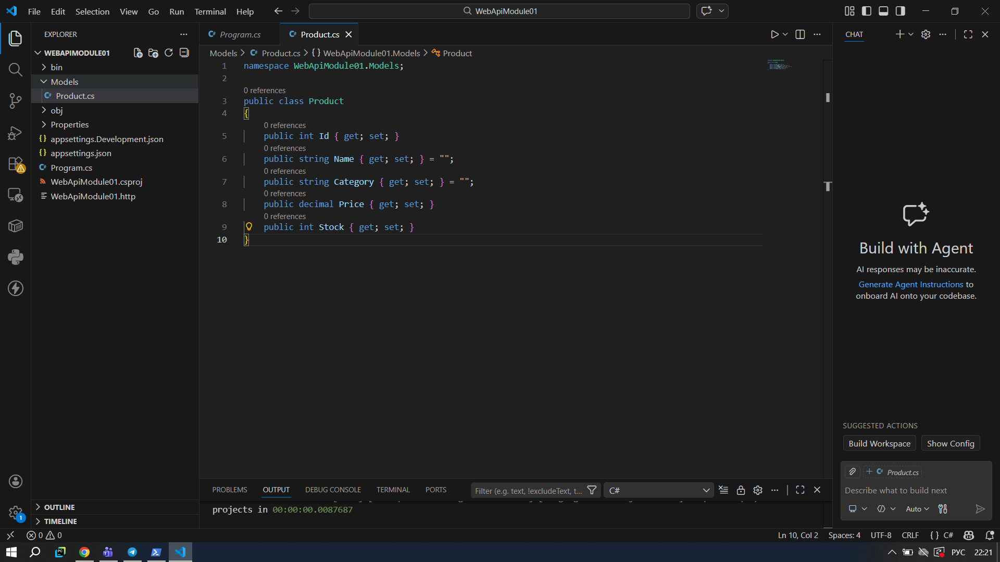
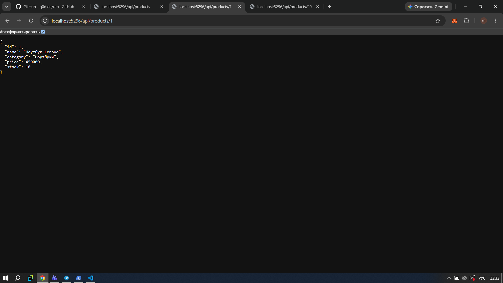
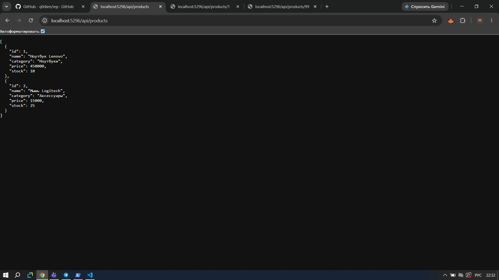
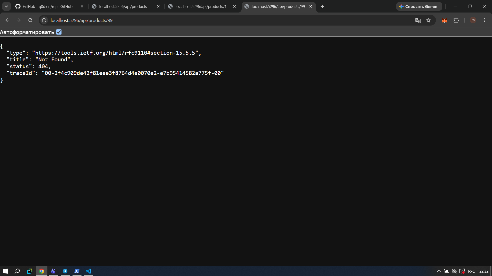
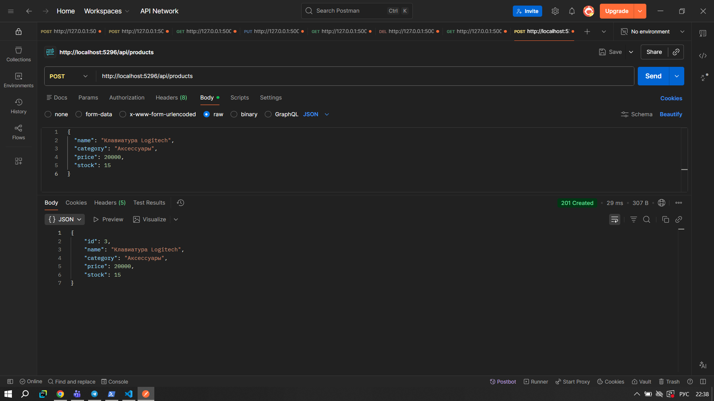
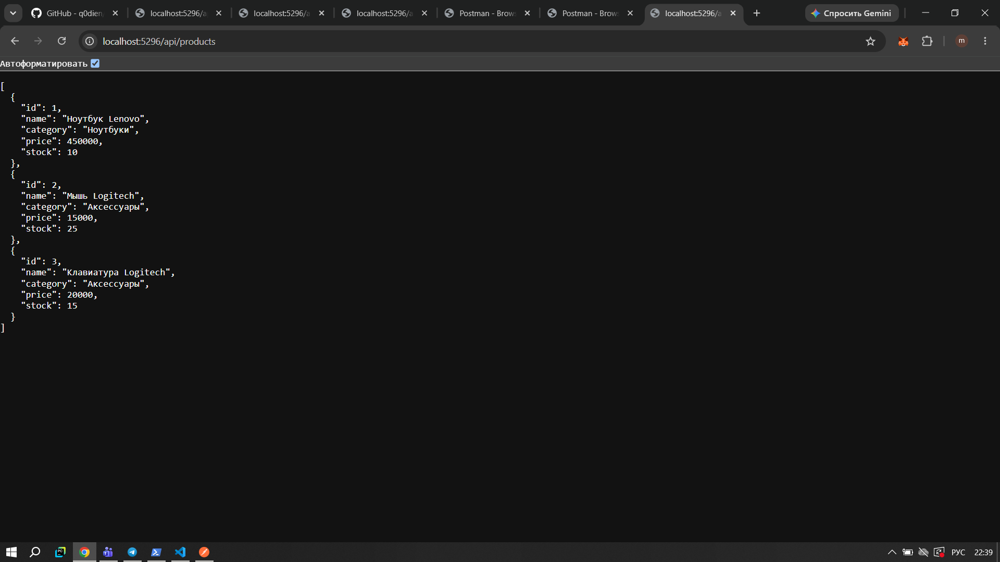

# Task 5 — Проверка API

Я проверила работу API на нескольких запросах.

## 1. Создание проекта

## 2. Создание продукта

## 3. Получение товара

## 4. Получение списка товаров

## 5. Проверка ошибки 404

## 6. Добавление товара через Postman

## 7. Проверка после добавления

После POST-запроса в списке стало 3 товара.

